# 국내 대표 팬덤 100개 LDA 토픽모델링 — 팬충성도 × 파급효과 × 팬 요인 구조

> **핵심 요약판.**  보고서(`(분석보고서)…최종.pdf`, `(요약보고서)…최종.pdf`)의 최종 결과·대표 차트·모델 설명을
> 한 페이지로 압축했다. 저장소의 모든 수치는 `verify_v7_final_consistency.py`(107/107)와 R 교차검증(238/238)으로 파일에서 재현된다.

| 항목 | 내용 |
|---|---|
| 분석 대상 | 국내 대표 팬덤 100개 (K-pop 보이·걸그룹, 트로트, 솔로, 밴드, 원로그룹, 힙합 등) |
| 데이터 | 뉴스·위키·공식자료·커뮤니티 등 공개 웹 자료 기반 **근거 문장 10,020건** (14개 언어권, LDA 재적합 문서 10,018건) — `data/v7_final/fandoms_v3_100.json` |
| 핵심 모델 | **LDA 토픽(K=8) → 메타팩터(M=5) → 파급경로(F1∼F5) → 페르소나(4유형)** 4단계 해석 계층. 라이브 코퍼스 10,020건의 재적합이며, 최종 보고서 PDF의 동결 스냅샷(v7-40, 7,350건, K=10)은 역사 값으로 보관(8절) |
| 점수 | 근거문장별 EvidenceScore 합산 → min-max 정규화한 **팬충성도·파급효과**, 메타팩터 분포 엔트로피 **팬 요인 다양성**(3D 맵 Z축), 언어·시장·출처·시간·엔티티 가중합 **Coverage Index** |
| 보조지표 7종 | 광고·상업성 1,302건(13.0%) · 팬덤결속 923건(9.2%) · 미디어·콘텐츠 노출 1,025건(10.2%) · 매체 크로스오버 6,712건(67.0%, 매체 1,298개) · 국내 지역 · 멤버 집중도(MCI) · 세계 언어 — LDA와 무관한 원문 키워드·도메인 매칭 |
| 인터랙티브 산출물 | [`3D_포지셔닝맵_국내100팬덤.html`](3D_포지셔닝맵_국내100팬덤.html) (+`plotly-bundle.js`) · 단독 실행판 [`3D_포지셔닝맵_국내100팬덤_단독.html`](3D_포지셔닝맵_국내100팬덤_단독.html) (Plotly 내장, 파일 하나로 열림) · [`Persona_결정공간.html`](Persona_결정공간.html) · QR 코드 [`qr_codes/`](qr_codes/) |

---

## 0. 한눈에 보기 — 이 분석이 말하는 것

팬덤의 영향력은 "얼마나 큰가" 하나로 줄어들지 않는다. 안으로 뭉치는 힘(팬충성도)과 밖으로 번지는 힘(파급효과)은 한쪽이 커지면
다른 쪽이 눌리는 관계에 있고, 그 영향력이 어느 경로로 나가는지가 팬덤의 유형을 가른다. 이 저장소는 그 구조를 위 표의 데이터에서 재현 가능한 숫자로
보여 주기 위해 만들어졌다.

**왜 두 축을 따로 재는가.** 팬덤에 관한 근거 문장은 "팬클럽이 기부 캠페인을 열었다"처럼 결속을 말하는 문장과 "콘서트로 지역 상권 매출이 늘었다"처럼
바깥으로의 파급을 말하는 문장으로 갈린다. 같은 팬덤이라도 언론이 어느 쪽을 더 많이 다루느냐가 다르므로, 두 종류의 문장을 각각 점수화해
2차원 평면에 놓으면 팬덤이 어디에 서 있는지가 드러난다. 여기에 그 팬덤의 화제가 콘서트·소비·브랜드·차트·미디어 가운데 얼마나 고르게
퍼져 있는지를 세 번째 축(팬 요인 다양성)으로 더해 영향력의 크기와 구조를 함께 본다.

**해석은 어떻게 만들어지는가.** 문장을 LDA로 여덟 개의 토픽으로 묶고, 토픽 간 단어 분포가 비슷한 것끼리 다시 다섯 개 메타팩터로 묶은 뒤,
각 메타팩터가 팬덤 활동을 어디로 전이시키는지에 따라 F1(팬덤 결속)부터 F5(대중·글로벌 확산)까지 경로 이름을 붙인다. 팬덤마다 비중이 큰
경로 두 개를 고르면 페르소나가 정해진다. 최종 보고서는 이 계층을 동결 스냅샷(v7-40)에 고정했지만, 그 기준선(실루엣 0.267)이 저장소 재료로 재현되지 않아 이 README는 최종 라이브 코퍼스의 K=8 재적합을 해석 계층으로 쓴다(8절).

**무엇이 확인됐는가.** 첫째, 두 점수는 겉으로는 함께 오르내리지만 근거 문장 수를 통제하면 충성도 계수의 부호가 음으로 뒤집힌다. 팬덤에 관해 쓰이는 기사와 자료의 양이 정해져 있을 때, 결속 이야기가 많아질수록 파급 이야기는 줄어드는
트레이드오프 관계다. 둘째, 실제로 나타난 페르소나 네 유형이 모두 F3(현장경제) 경로를 공유한다. 콘서트에 가는
행위가 유형 분화의 출발점이고, 거기서 글로벌 확산·상업·소비·동원 중 어디로 갈라지는지가 유형을 만든다. 셋째, 근거를 다섯 배 넘게 늘려도
군집 안정성은 좋아지지 않았다. 리서치를 더 하면 통계가 안정된다는 가정은 이 데이터에서 성립하지 않았다.

**어디부터 볼까.** 팬덤이 3축 공간 어디에 있는지는 회전되는 [3D 포지셔닝 맵](3D_포지셔닝맵_국내100팬덤.html)에서, 페르소나가 어떤 비중
조합으로 결정되는지는 [결정공간 페이지](Persona_결정공간.html)에서 직접 만져 볼 수 있다. 본문에 인용된 모든 수치의 근거 파일은
[`KEY_FINDINGS.md`](v7_final_10020/docs/KEY_FINDINGS.md)에, 산식을 코퍼스에서 처음부터 다시 계산해 보는 과정은
[지표 산정 노트북](v7_final_10020/index_methodology/index_calculation_v7.ipynb)에 있다.

---

## 1. 핵심 발견 3가지

1. **영향력의 크기보다 구조가 갈린다.** 팬충성도·파급효과 종합 점수와 Coverage Index·팬 요인 다양성은 서로 다른 것을 재며 같은 방향으로 움직이지 않는다. 단일 점수 순위보다 요인 구성의 다양성이 팬덤 간 차이를 더 잘 설명한다.
2. **선두는 근거가 쌓일 때마다 바뀌었다.** 파급효과 1위(BTS → TWICE → … → BTS), 팬충성도 1위(임영웅 → SEVENTEEN 등)가 라운드마다 교체됐다. 데이터를 조정한 결과가 아니라 새로 확인된 근거를 그대로 반영한 결과다.
3. **리서치를 늘려도 군집 안정성은 좋아지지 않았다.** 코퍼스가 1,781건→9,680건(+444%)으로 자라는 동안 K→M 재군집화의 실루엣은 0.058∼0.148을 등락했고 기준선 0.267에 한 번도 닿지 못했다(게이트 구간 20회 실측, 최종 보고서 시점 누적 **28회 연속 기각**). 최종 보고서는 그래서 해석 계층을 v7-40 스냅샷에 고정하는 **이원 구조**를 택했다.

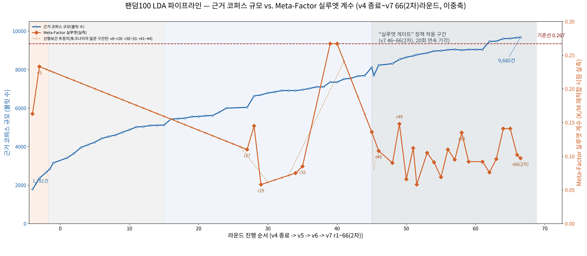

*그림 1. 코퍼스 규모(막대) vs 메타팩터 실루엣(선). 게이트 구간(r46∼r66 2차)의 코퍼스–실루엣 상관은 r=+0.15로 사실상 무관하다. 재현: `v7_final_10020/silhouette_gate_policy/`*

---

## 2. 모델 구조

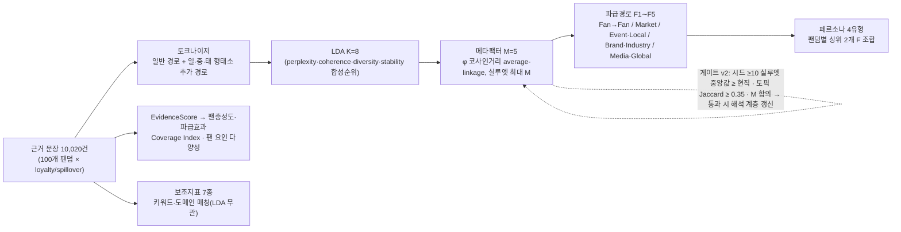

**지표 산식** (전체 정의와 검증: [`v7_final_10020/index_methodology/`](v7_final_10020/index_methodology/))

| 지표 | 식 | 저장소 재현 |
|---|---|---|
| EvidenceScore | Σ_t [1.0 + 0.5·n_num(t) + 0.3·n_kx(t)] — 문장당 기본 1점 + 수치표현 0.5 + 보너스 키워드(충성도 19·파급효과 18) 0.3 | 코퍼스에서 100/100 원점수 재현 |
| 팬충성도·파급효과 | 원점수의 표본 내 min-max 정규화 (0∼1) | 3D 맵 payload와 100/100 일치 |
| Coverage Index | 0.30·언어 엔트로피(ln 14) + 0.25·시장/6 + 0.20·출처유형/3 + 0.15·연도/12 + 0.10·엔티티/6 | 100/100 일치 (불일치 0) |
| 팬 요인 다양성 | −Σ pₘ ln pₘ / ln M — 메타팩터 비중 분포의 정규화 엔트로피 | 100/100 일치 (불일치 0) |
| 활동량 | 충성도 + 파급효과 근거문장 수 (합 10,020) | 100/100 일치 (불일치 0) |

**두 데이터 계층** — 같은 팬덤의 점수가 파일마다 다르게 보이는 이유

| 계층 | 코퍼스 | 이 계층에서 나온 수치 | 대표 파일 |
|---|---|---|---|
| 라이브 코퍼스 (최종, 해석 계층 + 지표) | 10,020건 | K=8→M=5, F1∼F5 비중, 페르소나 62/17/12/9, 전체 순위표, 팬충성도·파급효과 점수(평균 0.371/0.266), 4구획 24/17/10/49, 통계 검정, 보조지표 7종, 3D 맵 | `fandoms_v3_100.json`, `fandom_scores_live_reference_v7.json`, `chart3d_payload_live_reference_v7.json`, `analysis/persona_decision_space/live_interpretive_layer/` |
| 동결 스냅샷 v7-40 (최종 보고서 PDF, 보관) | 7,350건 | K=10→M=5, F1∼F5 비중, 페르소나 43/31/17/9, PDF의 순위표 | `fandom_scores_v6.json`, `fan_persona_v7.json`, `lda_v6_diagnostics_frozen_v7_40.json` |

---

## 3. 3D 포지셔닝 맵과 통계적 가설검정 (라이브 코퍼스 기준)

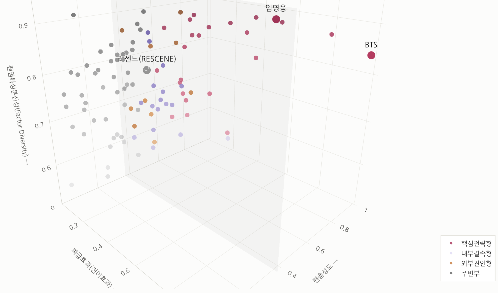

*그림 2. 100개 팬덤 3D 포지셔닝 맵 — X 파급효과 × Y 팬충성도 × Z 팬 요인 다양성. `3D_포지셔닝맵_국내100팬덤.html`의 기본 카메라 구도를 그대로 캡처한 것으로, 점 색은 4구획(핵심전략형·내부결속형·외부견인형·주변부), 반투명 면은 표본 평균 기준선이며 BTS·임영웅·리센느를 강조했다. Z축은 영향력의 크기가 아니라 구조(화제가 여러 경로에 고르게 분포하는지)를 잰다. HTML을 열면 회전·필터·버블 크기 전환이 가능하다.*

| 검정 | 결과 | 해석 |
|---|---|---|
| 정규성(Shapiro-Wilk) | 두 점수 모두 p<.05 | 정규분포 아님 → 순위 검정 병행. 강건 회귀(Huber·분위·영향점 제외)에서도 계수 부호·유의성 동일 |
| Pearson r | **0.493** (p<.001, R²=0.243) | 설계 기준 \|r\|<0.5 충족 (동결 스냅샷은 미충족) |
| Spearman ρ | 0.380 (p<.001) | 방향·유의성 일치 |
| 다중회귀 R² (+활동량 통제) | 0.243 → **0.847** | 두 점수가 근거문장 수를 공통 기반으로 함 |
| 충성도 회귀계수 (+활동량 통제) | **−0.200** (p<.001) | 부호 반전 → 근거 문장 수가 같다면 결속과 파급은 서로를 밀어내는 트레이드오프 |
| VIF | 1.93 | 다중공선성 문제 없음 |
| 4분면 독립성 χ² (0.5 기준 2×2) | **8.34**, p=0.0039 | 두 축 독립 가정 기각 |
| Loyalty–Diversity / Spillover–Diversity | r=0.099 (n.s.) / **0.461** (p<.001) | Z축은 충성도와 독립, 파급효과와는 상관 |

영향점(Cook's D) 상위: BTS 0.575 · god 0.284 · 이효리 0.254 · TWICE 0.232 · BLACKPINK 0.094. 이효리는 충성도 0.006에 파급효과 0.654로 표준화 잔차 +3.59의 극단 사례다.

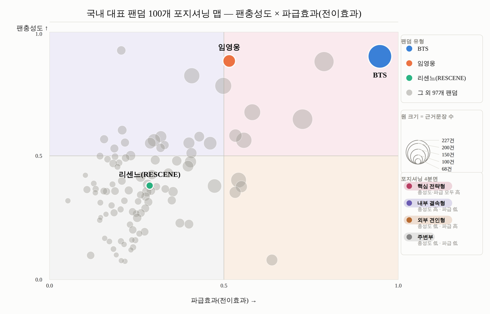

*그림 3. 팬충성도 × 파급효과 2D 포지셔닝 맵(제출 보고서 2-6절). 버블 크기는 근거문장 수다. 3절 표의 χ²는 이와 별도로 0.5 기준 2×2표([[7,17],[4,72]])로 계산한 값이다.*

**4구획 읽는 법.** 기준선은 100개 팬덤의 표본 평균이다(팬충성도 0.371, 파급효과 0.266). 두 축이 모두 평균 이상이면 **핵심전략형(24개)** 으로, 결속력과 파급력을 모두 갖춘 팬덤이며 BTS·TWICE·임영웅·Stray Kids·BLACKPINK가 여기 속한다. 충성도만 평균 이상이면 **내부결속형(17개)** 으로, 결속력은 높으나 외부로 퍼지는 파급력은 낮은 유형이다(SEVENTEEN·NCT·RIIZE·레드벨벳 등). 파급효과만 평균 이상이면 **외부견인형(10개)** 으로, 언론·브랜드가 먼저 끌어 주지만 팬덤 결속 근거는 상대적으로 적은 유형이다(NewJeans 등). 둘 다 평균 이하인 **주변부(49개)** 가 절반 가까이를 차지하는데, 이는 근거문장 수가 적은 팬덤이 두 점수 모두 낮게 나오는 구조와 맞물린다(두 점수 모두 활동량과 상관 0.69·0.90). 4구획은 통계적 군집이 아니라 평균선 기준의 규칙 분류이므로, 경계 근처 팬덤은 근거가 몇 건만 더해져도 구획이 바뀔 수 있다.


*그림 4. Q-Q plot(R, `Statistics/R_통계검증/`) — 팬충성도(W=0.954)와 파급효과(W=0.861)는 우측 꼬리에서 정규성이 기각되고, 팬 요인 다양성(W=0.975, p=0.058)은 유지된다. 통계량 전부는 R과 `Statistics/verify_r_sections_python.py`로 238/238 재현.*

---

## 4. 팬충성도 + 파급효과 상위 15개 팬덤 (라이브 해석 계층)

| 순위 | 팬덤 | 팬충성도 | 파급효과 | 대표 요인 | 구획 | 동결 순위 |
|---|---|---|---|---|---|---|
| 1 | BTS | 0.97 | 1.00 | 현장경제형 | 핵심전략형 | 1 |
| 2 | TWICE | 0.95 | 0.82 | 현장경제형 | 핵심전략형 | 2 |
| 3 | 임영웅 | 0.95 | 0.52 | 현장경제형 | 핵심전략형 | 3 |
| 4 | BLACKPINK | 0.67 | 0.75 | 현장경제형 | 핵심전략형 | 5 |
| 5 | NCT | 0.83 | 0.50 | 현장경제형 | 핵심전략형 | 8 |
| 6 | Stray Kids | 0.71 | 0.59 | 현장경제형 | 핵심전략형 | 4 |
| 7 | SEVENTEEN | 0.88 | 0.40 | 현장경제형 | 핵심전략형 | 6 |
| 8 | god | 1.00 | 0.17 | 현장경제형 | 내부결속형 | 37 |
| 9 | aespa | 0.57 | 0.56 | 현장경제형 | 핵심전략형 | 10 |
| 10 | 지드래곤 (G-Dragon) | 0.60 | 0.54 | 현장경제형 | 핵심전략형 | 7 |
| 11 | CORTIS | 0.56 | 0.46 | 현장경제형 | 핵심전략형 | 9 |
| 12 | 아이유 | 0.59 | 0.42 | 현장경제형 | 핵심전략형 | 15 |
| 13 | EXO | 0.56 | 0.39 | 현장경제형 | 핵심전략형 | 21 |
| 14 | NewJeans | 0.39 | 0.55 | 현장경제형 | 핵심전략형 | 11 |
| 15 | 싸이 | 0.35 | 0.56 | 현장경제형 | 외부견인형 | 16 |

동결 스냅샷 순위표(최종 보고서 PDF 4절)와 상위 15 겹침 12/15, 공통 97개 팬덤 순위 Spearman 0.83. 라이브에서 god·EXO·싸이가 들어오고 RIIZE·ATEEZ·레드벨벳이 빠졌다. 전체 100개 순위는 `live_interpretive_layer/live_full_ranking_v7.csv`. 점수는 팬덤별 근거문장 수에 크게 좌우된다(8절).

---

## 5. K → F → 페르소나 해석 계층

| 계층 | 답하는 질문 | 정의 | 파일 |
|---|---|---|---|
| K (Topic) | 무엇을 하는가 | LDA 토픽 8개 (브랜드앰버서더·음원차트기록·단독콘서트투어·해외투어음반·페스티벌무대·예능영화출연·팬클럽공식활동·드라마OST기부) | `live_interpretive_layer/live_k_to_f_v7.csv` |
| F (Impact Pathway) | 어디로 전이되는가 | 메타팩터 5개를 파급경로로 재명명 — F1 팬덤결속(Fan→Fan) · F2 직접소비(Fan→Market) · F3 현장경제(Fan→Event→Local) · F4 산업전이(Fan→Brand/Industry) · F5 대중·글로벌 확산(Fan→Media→Global) | `factor_pathway_map_v7.json` |
| Persona | 어떤 방식으로 작동하는가 | 상위 2개 F 조합 10가지 중 실현 4유형: **글로벌투어형 62**(F3+F5) · **원정소비형 17**(F2+F3) · **현장상업형 12**(F3+F4) · **집단동원형 9**(F1+F3) — 전부 F3 공유 | `live_interpretive_layer/live_persona_v7.json` |
| Loyalty·Spillover | 얼마나 강한가 | 점수를 F별로 분해한 Factor-specific Impact = 비중 × 점수 | 같은 파일 |

| 토픽 | 이름 | 상위 10단어 | F (파급경로) |
|---|---|---|---|
| T0 | 브랜드앰버서더형(브랜드·광고·모델·앰버서더) | 브랜드, 광고, 모델, 앰버서더, 발탁, 캠페인, 글로벌, 출연, 2025년, 2024년 | **F4** 산업전이 경로 |
| T1 | 음원차트기록형(기록·1위·앨범·발매) | 기록, 1위, 앨범, 발매, 데뷔, 차트, 최초, k팝, 그룹, 빌보드 | **F5** 대중·글로벌 확산 경로 |
| T2 | 단독콘서트투어형(콘서트·공연·단독·투어) | 콘서트, 공연, 보도, 단독, 매체, 투어, 티켓, 서울, 2025년, 월드투어 | **F3** 현장경제 경로 |
| T3 | 해외투어음반형(fan·japan·tour·album) | fan, japan, tour, concert, sold, album, million, group, music, official | **F2** 직접소비 경로 |
| T4 | 페스티벌무대형(무대·축제·페스티벌·대학축제) | 무대, 2026년, 함께, 축제, 페스티벌, 화제, 반응, 영상, 콘텐츠, 대학축제 | **F3** 현장경제 경로 |
| T5 | 예능영화출연형(출연·예능·영화·일본) | 출연, 데뷔, 예능, 일본, 2026년, 활동, 2025년, 함께, 영화, 출연해 | **F3** 현장경제 경로 |
| T6 | 팬클럽공식활동형(공식·팬클럽·홍보대사·팬덤) | 공식, 팬클럽, 활동, 중국, 팬덤, 보도, 홍보대사, 팬들, 라는, 8월 | **F3** 현장경제 경로 |
| T7 | 드라마OST기부형(ost·드라마·기부·수상) | ost, 드라마, 기부, 수상, 2025년, 팬클럽, 지원, 참여, 원을, 부문 | **F1** 팬덤결속 경로 |

라이브의 raw 요인에는 동결의 '미디어노출형' 대신 '브랜드·상업형'이 있어 이를 F4 산업전이로 뒀다. 동결 대비 같은 페르소나를 유지한 팬덤은 공통 97개 중 49개이고, 동결 현장상업형 31개 중 16개가 라이브에서 글로벌투어형으로 옮겨갔다(`live_interpretive_layer/persona_migration_v7.csv`).

<p align="center">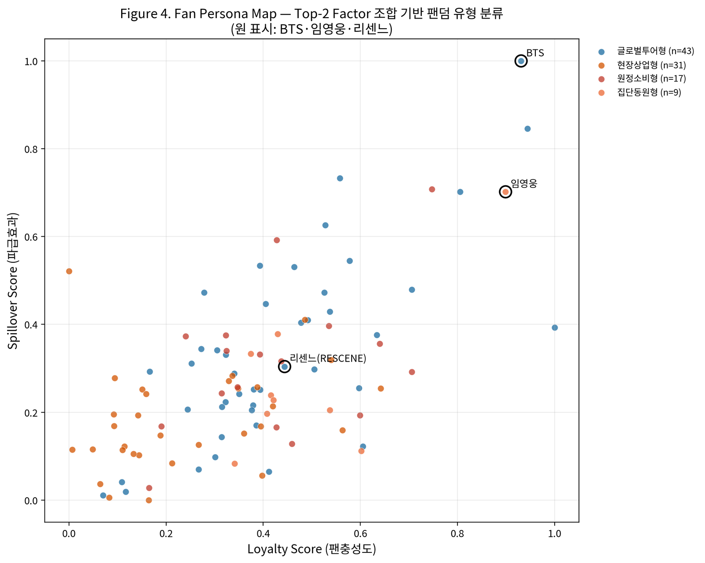</p>

*그림 5. Fan Persona Map — 팬충성도 × 파급효과 평면의 페르소나 4유형 분포. 점선은 표본 평균(0.371/0.266).*

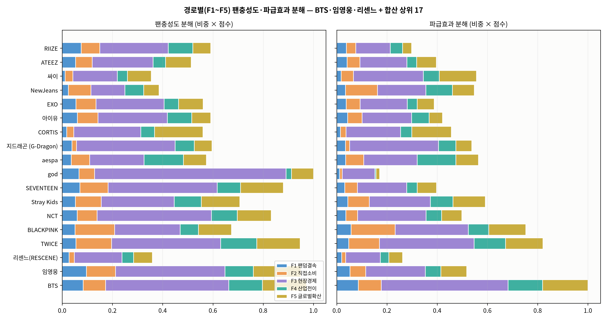

*그림 6. 경로별(F1∼F5) 팬충성도·파급효과 분해 — BTS·임영웅·리센느와 합산 상위 17개 팬덤. 세 팬덤 모두 1위 경로는 F3(현장경제)로 같고, F5(글로벌 확산) 파급효과 기여는 BTS 0.180 · 임영웅 0.103 · 리센느 0.055이다.*

<p align="center">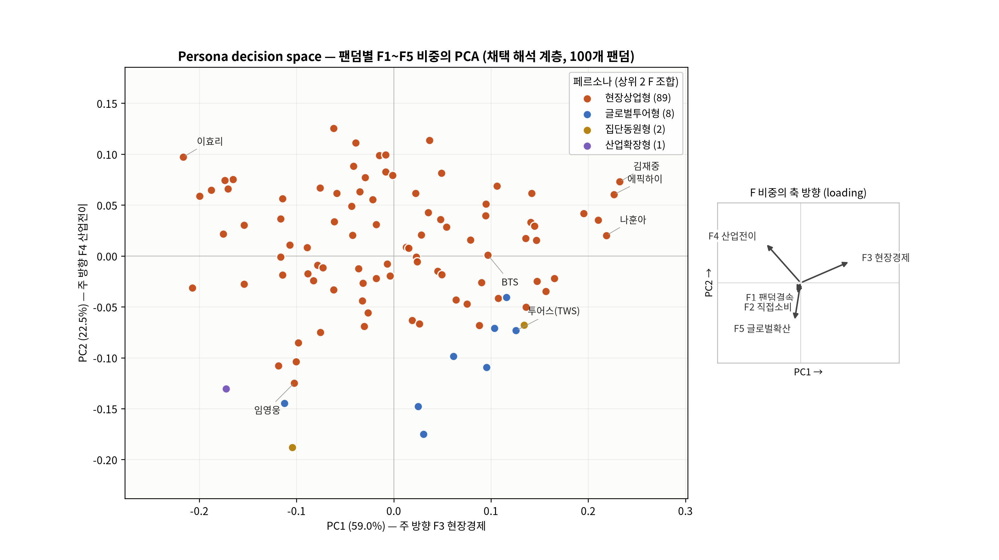</p>

*그림 7. 페르소나를 결정하는 F1∼F5 비중 공간의 PCA(PC1 56.6%, PC2 23.1%); 오른쪽 패널은 F별 loading 방향. 왼쪽 위에 홀로 떨어진 점은 투어스(TWS)로, 근거 90건 중 86건이 영문으로 수집돼 영문 토큰이 F2(직접소비)로 몰린 수집 언어의 결과다(F2 비중 0.74). 동결 K=10 덴드로그램은 `assets/readme/fig07a_persona_dendrogram_frozen_v7_40.png`. 생성: `v7_final_10020/charts/build_live_layer_figures_v7.py`.*

---

## 6. 보조지표 7종 (라이브 코퍼스 10,020건)

| 지표 | 무엇을 재나 | 산정 | 결과 요약 |
|---|---|---|---|
| 광고·상업성 지수 | 광고 계약·앰버서더·협찬 문장 비중과 20개 업종 구성 | 광고신호 키워드 31개 → 업종 사전 다중분류 | 1,302건(13.0%). 복지/행정 228 · 패션/의류 209 · 미용 177 · 식음료 169 · 정보/통신 94 |
| 미디어·콘텐츠 노출 지수 | 예능·유튜브·영화·드라마 노출 | 4개 서브태그 키워드 매칭 | 1,025건(10.2%), 99/100 팬덤 (투어스 0건) |
| 팬덤결속 지수 | 조직적 결속력 5유형(A 공식팬클럽 · B 팬카페 · C 정체성 · D 기부 · E 오프라인 결집) | 유형별 키워드 매칭 | 923건(9.2%), 상위 임영웅·김재중·김호중·이찬원·정동원 |
| 매체 크로스오버 지수 | 매체 확산 폭(유입 경로·전환이 아님) | 출처 URL의 뉴스 도메인 수 | news_media 6,712건, 서로 다른 매체 1,298개 |
| 국내 지역 지수 | 17개 시/도 밀착도(언급의 84%가 공연·행사 등 활동, 연고는 6%) | 지역명 텍스트마이닝 | 지역 언급 1,226건, 검출 469, 99/100 팬덤. 서울 편중 뚜렷, 다양성 1위 임영웅(12지역, 0.71) |
| 멤버 집중도 MCI | 그룹 내 멤버 쏠림 | Σ(멤버 점유율)² (허핀달 방식, 하한 1/멤버수) | 45개 그룹. MCI∼멤버 수 r=−0.728, 멤버 수 통제 후 outcome 설명력 R²<0.05 |
| 세계 언어 지수 | 출처 매체 언어권의 다양성(본문 언어가 아님 — 본문은 84.5%가 한국어 요약) | Coverage의 언어 분포 재구성 | 해외언어 4,469건(44.6%), 100/100 팬덤. 영어 2,195(49.1%) · 일본어 · 중국어 순 |

| 해외언어별 근거 순위 | 팬덤별 해외언어 구성 (상위 20, Worldwide Language Pilot) |
|---|---|
| 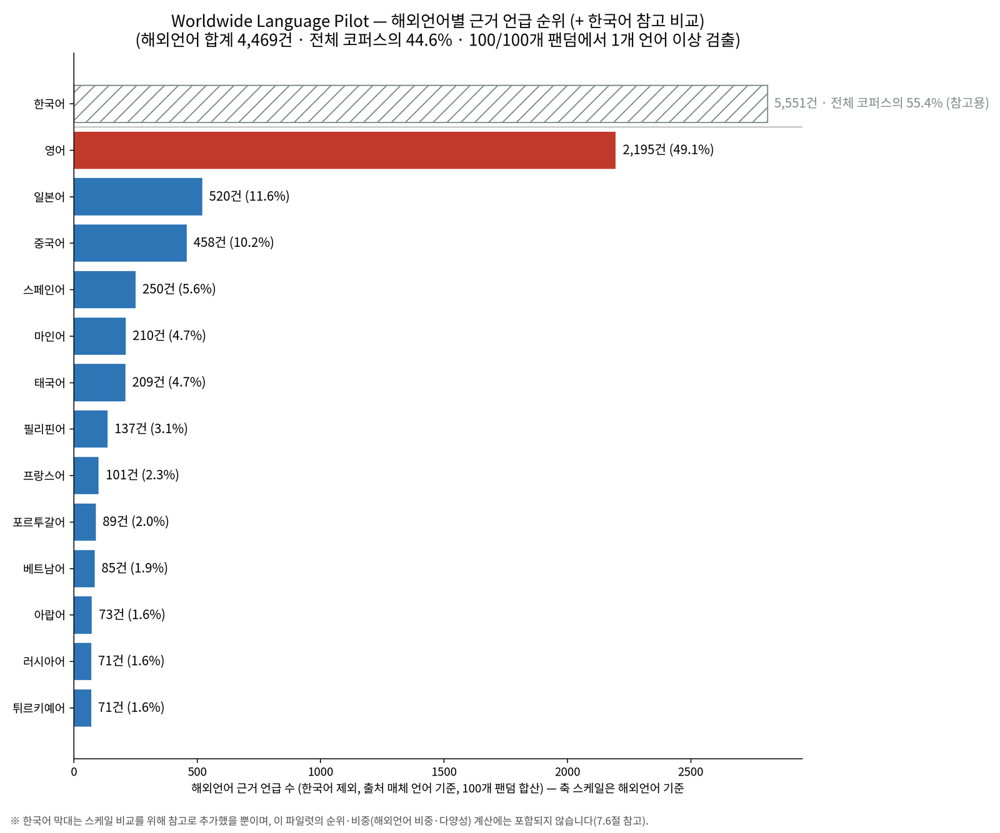 | 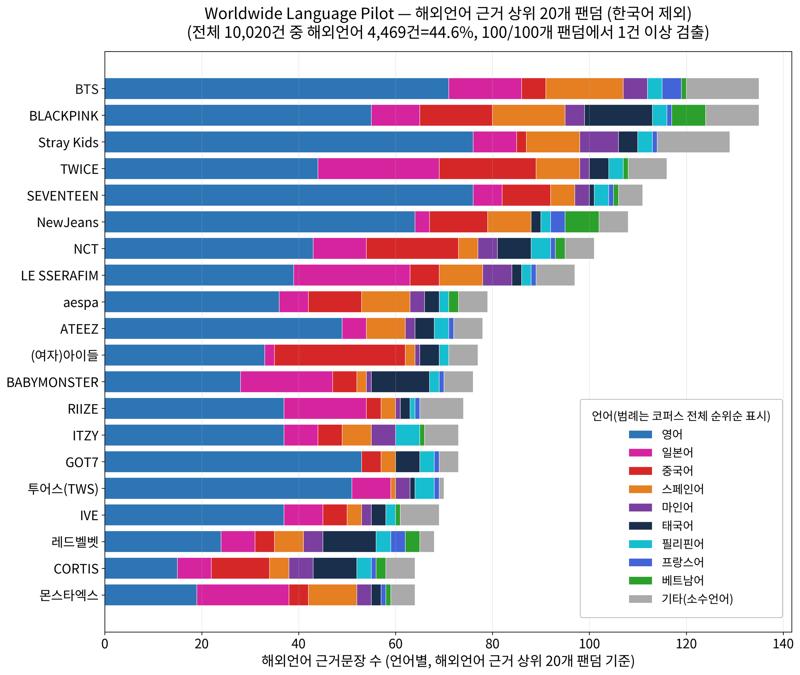 |

| 미디어·콘텐츠 노출 (상위 20) | 국내 지역 언급 순위 |
|---|---|
| 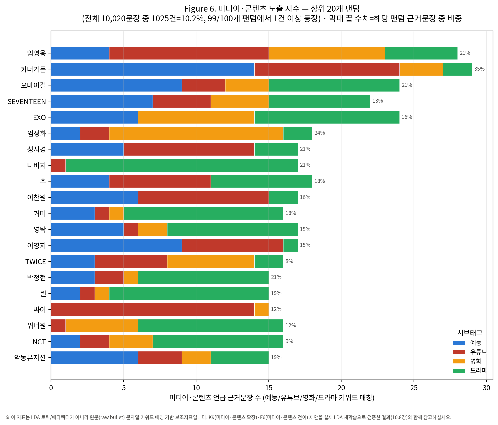 | 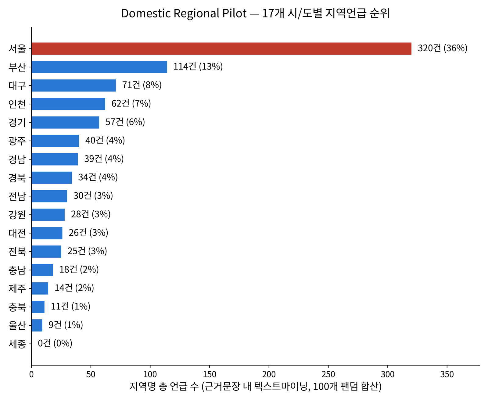 |

| 팬덤결속 지수 (유형별 순위 · 상위 25) | 업종별 광고·상업성 순위 |
|---|---|
| 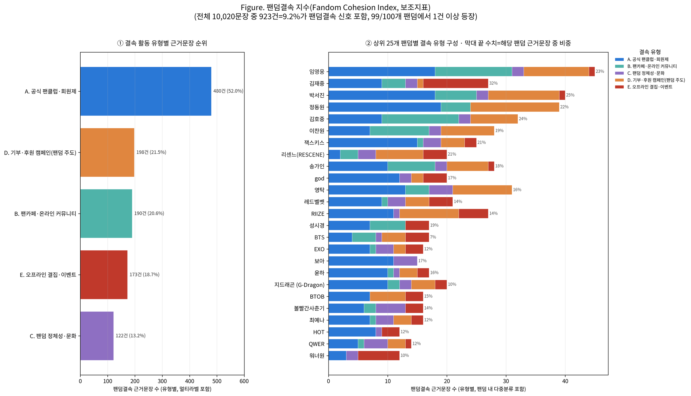 | 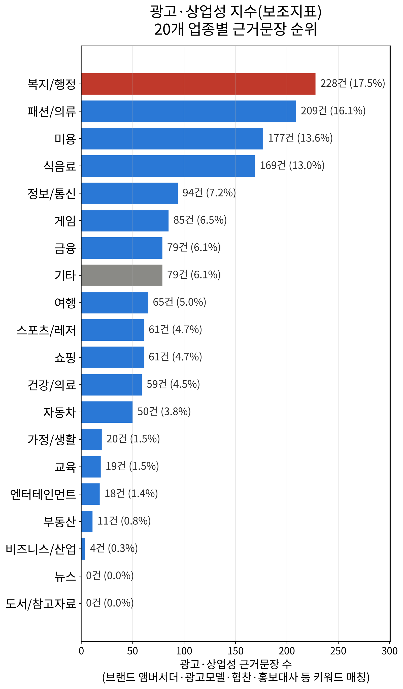 |

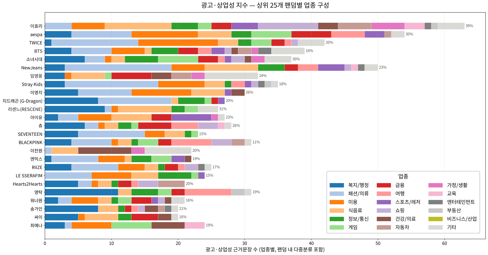

*그림. 팬덤별 광고·상업성 업종 구성(상위 25) — 20개 업종 누적 막대, 팬덤 내 다중분류 포함.*

**MCI 상위·하위와 설명력** (`member_mention_index_v7.json`, 상관은 상세 보고서 7.4절 표)

| 그룹 | 멤버 언급 | 상위 멤버(점유율) | MCI |
|---|---|---|---|
| FTISLAND | 23 | 이홍기 0.78 · 이재진 0.22 | 0.660 |
| 동방신기 | 33 | 유노윤호 0.58 · 최강창민 0.42 | 0.512 |
| CNBLUE | 24 | 정용화 0.67 · 강민혁 0.21 · 이정신 0.13 | 0.504 |
| … | | | |
| SEVENTEEN | 68 | 승관 0.15 · 버논 0.15 · 조슈아 0.13 | 0.112 |
| NCT | 61 | 마크 0.16 · 도영 0.15 · 윈윈 0.15 | 0.111 |

원시 MCI가 가장 잘 설명하는 outcome은 팬충성도(r=−0.385, R²=0.148)지만, 멤버 수를 뺀 MCI_excess로는 어떤 outcome도 유의하지 않다(최대 R²=0.046). MCI는 집중도보다 멤버 수를 대리하는 지표에 가깝다. 라이브 점수로 시점을 맞춰도 결론은 같다(`v7_final_10020/analysis/group_member_index/MCI_SAME_PERIOD_V7.md`).

---

## 7. 토크나이저와 언어(문자권)별 워드클라우드

`tokenize(text, url)`은 2단 구조다. **일반 경로**(정규식 + 언어별 불용어)가 모든 문장에 먼저 적용되고, 본문에 가나·한자·태국 문자가 실제로 있을 때만 **fugashi(일본어)·jieba(중국어)·pythainlp(태국어)** 형태소 분석 결과를 위에 얹는다. 출처 도메인 태그가 아니라 본문 문자로 분기하는 이유는, 일본·중국 매체를 인용한 문장 대다수가 한국어 요약문이라 태그 기준 분기가 콘텐츠를 날려 버렸기 때문이다.

| 문자권 | 불릿 수 | 토큰 총계 | 어휘 종수 |
|---|---:|---:|---:|
| 한국어 | 8,942 | 134,027 | 21,279 |
| 영어 | 6,425 | 32,332 | 7,226 |
| 중국어 | 398 | 1,816 | 1,211 |
| 일본어 | 155 | 895 | 549 |
| 러시아어 | 45 | 471 | 367 |
| 비영어(라틴) | 219 | 470 | 338 |
| 태국어 | 56 | 411 | 278 |
| 베트남어 | 30 | 303 | 205 |

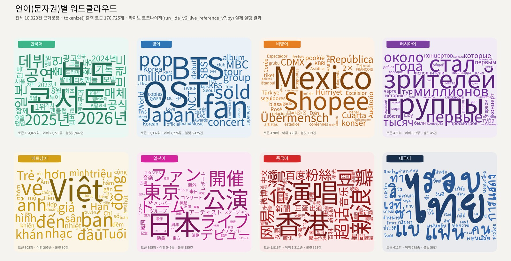

*그림 15. 10,020건 전체에 토크나이저를 실행한 결과(토큰 170,725개). 불용어 목록은 `v7_final_10020/analysis/tokenizer/stopwords/`, 보고서 전문은 `v7_final_10020/tokenizer_wordcloud_report/`.*

**K 토픽 · F 메타팩터 워드클라우드 (동결 스냅샷 v7-40; 라이브 K=8 토픽의 상위어는 5절 표)**

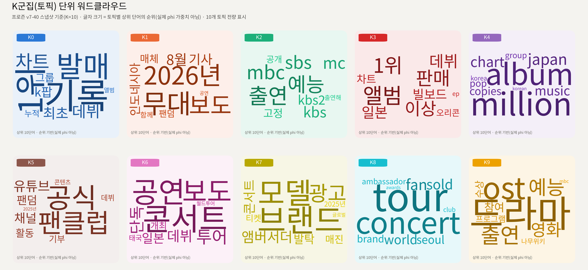

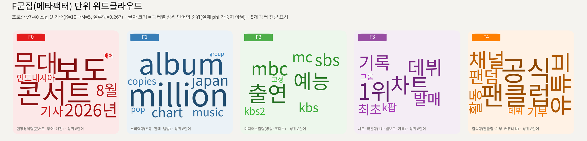

*그림 16·17. 위는 LDA 토픽 10개(K0∼K9)의 상위 10단어, 아래는 메타팩터 5개(F0 현장경제형 · F1 소비력형 · F2 미디어노출형 · F3 차트·확산형 · F4 결속형)의 상위 8단어. 글자 크기는 순위의 역순 점수이며 φ 확률이 아니다. 여기의 F0∼F4는 5절의 파급경로 코드 F1∼F5와 다른 번호 체계다(대응은 `factor_pathway_map_v7.json`).*

---

## 8. 한계 및 결론

- 전수조사가 아니라 뉴스·위키·공개 커뮤니티 표본이며, SNS는 2차 보도로만 반영된다.
- **해석 계층은 두 가지다.** 최종 보고서 PDF는 동결 스냅샷 v7-40(7,350건, K=10, 실루엣 0.267)을, 이 README 4·5절은 라이브 코퍼스(10,020건, K=8)의 재적합을 쓴다. 동결 기준선 0.267은 저장소 재료로 재현되지 않았다: 근사 복원 코퍼스와 재구성 토크나이저로 다시 적합하면 0.07이고, 시드 10개 × K∈{8,10} × 코퍼스 2개 40회 적합에서도 최대 0.192다. 그래서 게이트를 '단일 실루엣 임계'에서 '시드 분포·토픽 안정성 합의'(v2)로 바꿨고, 이를 통과한 라이브 K=8 재적합을 해석 계층으로 채택했다(2026-09-23; `v7_final_10020/silhouette_gate_policy/GATE_POLICY_V2_PROPOSAL_V7.md`). 두 계층은 상위 15 겹침 12/15, 같은 페르소나 49/97로 다르며, PDF와 README 4·5절 수치는 일치하지 않는다. 동결 코퍼스 원본은 남아 있지 않아 `data/v7_final/frozen_snapshot_v7_40/`의 근사 복원본(7,326/7,350건)으로 대신한다.
- **판별타당도(|r|<0.5)와 Z축 독립성은 스냅샷에 따라 결론이 뒤집혔다.** 부트스트랩(B=2,000) r의 95% CI는 라이브 [0.25, 0.67]·동결 [0.46, 0.77]로 둘 다 0.5를 포함한다. 차이의 대부분은 팬덤별 근거문장 수 구조에서 온다(점수와 건수의 r≈0.90∼0.96). 건수를 걷어낸 밀도 정의로 보면 r은 라이브 0.43·동결 0.40으로 반전이 사라지지만 상위 15 순위는 원 지수와 5/15만 겹친다(`Statistics/BOOTSTRAP_CI_V7.md`, `v7_final_10020/index_methodology/EXPOSURE_ADJUSTMENT_V7.md`).
- **보조지표는 사전에 없는 표현을 놓친다.** 사전 밖 유사 표현이 든 미매칭 불릿은 광고 284건(3.3%), 미디어 214건(2.4%), 지역 93건(1.0%)이며, 표본 200건씩의 모델 판독 재현율 추정은 광고 0.81·미디어 0.57·지역 0.78이다(`v7_final_10020/analysis/unmatched_audit/`, 사전 추가 후보 `analysis/dictionaries/dictionary_candidates_from_audit_v7.csv`). MCI는 멤버 수가 적을수록 구조적으로 높다.
- 그럼에도 다중회귀·4구획·민감도 분석의 트레이드오프 구조는 두 스냅샷 모두에서 같았다. 팬덤 영향력은 **크기(점수)와 구조(요인 다양성·경로)를 함께** 봐야 한다는 것이 이 분석의 결론이다.

---

## 9. 저장소 안내

**재현 명령 (저장소 루트, Python 3.10+; scipy·statsmodels·scikit-learn·pandas·matplotlib, 토크나이저는 fugashi unidic-lite jieba pythainlp)**

```bash
python verify_v7_final_consistency.py                                        # 보고서 수치 ↔ data/v7_final 107/107
python Statistics/verify_r_sections_python.py                                # 통계 검정 238개 항목 (R 패키지와 같은 정답지)
python v7_final_10020/index_methodology/build_index_calculation_notebook.py  # 식(1)~(7) 지표 산정 노트북
python v7_final_10020/analysis/build_notebooks_v7.py                          # 보조지표·페르소나·토크나이저 노트북 8개
python v7_final_10020/analysis/persona_decision_space/build_persona_decision_space_notebook.py
```

**저장소에 없는 것과 대신 둔 것.** 동결 7,350건 코퍼스 원본, 동결 스냅샷의 φ·코사인 거리 행렬·학습 모델, 그리고 최종 참고 재적합을 만든 라우팅 토크나이저의 원본 소스는 원본 데이터 묶음에도 git 이력에도 없다. 대신 (1) `data/v7_final/frozen_snapshot_v7_40/`에 라이브 코퍼스 앞부분을 잘라 만든 근사 복원본(7,326/7,350건; 97개 팬덤은 EvidenceScore 지문까지 동결과 일치), (2) 루트의 `run_lda_v6_live_reference_v7.py`에 토크나이저 재구성본(원본 실행 결과와 LDA 문서 10,018/10,018, 총 토큰 170,726/170,725, 상위 30단어 238/240 일치), (3) `v7_final_10020/analysis/persona_decision_space/topic_phi_cosine/`에 최종 코퍼스의 φ·코사인 거리·모델 pickle과 시드 안정성 측정을 둔다. 방법·잔차·한계는 각 폴더의 README와 MD에 있다.

```
README.md                                   이 문서 (핵심 요약판)
(분석보고서)…최종.pdf, (요약보고서)…최종.pdf  제출본
3D_포지셔닝맵_국내100팬덤.html + plotly-bundle.js / Persona_결정공간.html   인터랙티브 산출물 (같은 폴더에서 열면 동작)
3D_포지셔닝맵_국내100팬덤_단독.html          위 3D 맵에 plotly-bundle.js를 내장한 단독 실행판 (내용 동일, 1.7MB)
qr_codes/                                   두 HTML의 QR 코드 + 아티팩트 링크·해시 대조
assets/readme/                              이 문서의 그림 (제출 보고서 PDF·보고서 docx 원본 그림 + 데이터에서 다시 그린 그림, 가로 최대 2,400px; Q-Q plot은 Statistics/R_통계검증/outputs/plots/ 의 R 산출물을 직접 참조)
fonts/                                      그림용 한글 글꼴(Noto Sans CJK KR 서브셋, OFL)
verify_v7_final_consistency.py              최종 수치 ↔ 파일 정합성 검증 (107/107)
run_lda_v6.py                               LDA 파이프라인 참고 구현, 구 토크나이저 판 (--data/--out)
run_lda_v6_live_reference_v7.py             같은 파이프라인 + 14개 언어 라우팅 토크나이저 재구성본 (최종 참고 재적합 재현용, 약 30분)
data/
  v7_final/            최종 코퍼스 10,020건 + 최종 산출물 + 동결 스냅샷 산출물 (폴더 README)
    frozen_snapshot_v7_40/   동결 7,350건 코퍼스 근사 복원본(7,326건, 97개 팬덤 문장 동일) + manifest + 후보 검사기
    roster_history_v7.csv / bullet_provenance_v7.csv   로스터 이력(106행) · 불릿별 추가 라운드 구간(10,020행, 사이드카)
  v7_rounds/           v6 단계 로그 3개 + v7 병합·교체 로그 전량 (마지막 r72가 10,020건)
  silhouette_gate_timeline/  실루엣 게이트 타임라인 CSV (v4 종료~r66 2차)
v7_final_10020/        ★ 10,020건 기준 문서·코드·노트북 전부 (폴더 README)
  docs/                  KEY_FINDINGS · METHODOLOGY · FINAL_REPORT_SUMMARY · PYTHON_CODE_SUMMARY · REPORT_DOCX_VERIFICATION
  analysis/              보조지표 7종·Fan Impact Pathway·토크나이저 노트북 8개 + 문서, 페르소나 결정공간 노트북(+φ·코사인 거리 산출, 동결 재적합 시도, 시드 안정성, 토픽 대응 자동화),
                         토크나이저 스크립트·불용어 정리(stopwords/), 지표 사전 고정(dictionaries/), 기술 상세명세서, 국내 지역 지수 JSON/CSV
  index_methodology/     지표 산식 문서 + 식(1)~(7) 산정 노트북(ipynb + Spyder용 .py) + 재검증 스크립트
  charts/ indices_csv/ data_export/   그림·지수 CSV·데이터 추출 스크립트 (출력은 output/)
  silhouette_gate_policy/  tokenizer_wordcloud_report/  report_scripts/
Statistics/R_통계검증/  보고서 2.1·2.2·3.8·7.4절 통계량을 R 표준 함수로 재계산 (238/238, RUN_ALL.R 하나로 실행)
Statistics/verify_r_sections_python.py   같은 238개 항목의 파이썬 판
Statistics/bootstrap_ci_v7.py + BOOTSTRAP_CI_V7.md   팬덤 부트스트랩 CI(라이브·동결·97개 공통 차이)와 코퍼스 축소 반복 — 판별타당도 결론의 불확실성
archive/v7_r13_corpus_5099.json   v7 r13 시점(5,099건) 코퍼스 — bullet_provenance_v7.csv 의 ≤r13 구간 경계용
archive/v6_r22_era_backup.zip   최종 코퍼스 확정 이전(v7 r22, 5,612건) 시점 자료 백업 — 본문은 참조하지 않음.
                                zip 안의 fandom_scores_v6.json·lda_v6_diagnostics.json은 data/v7_final의 동결(v7-40) 파일과 이름만 같은 r22 시점 값(archive/README.md 참고)
```

**검증 상태** (2026-09-23 전수조사, `v7_final_10020/docs/FULL_AUDIT_2026-09-23.md`): 파이썬 52개 컴파일 오류 0 · 노트북 10개 실행 오류 0 · 스크립트 30개 재실행 산출물 바이트 일치 · verify 107/107 · R 대응 238/238 · README 핵심 수치 15항목 ↔ 산출 JSON 일치 · 보고서 docx 대조 47/58(문장 오기 12건은 `REPORT_DOCX_VERIFICATION.md`).
