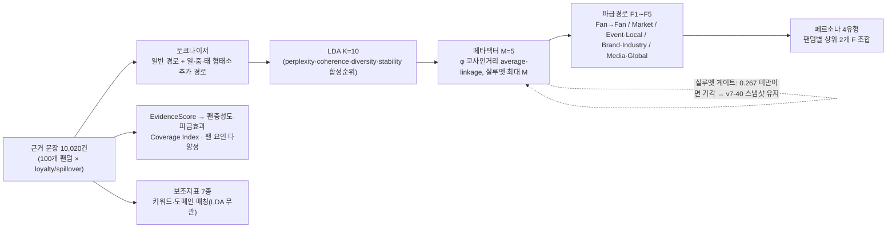
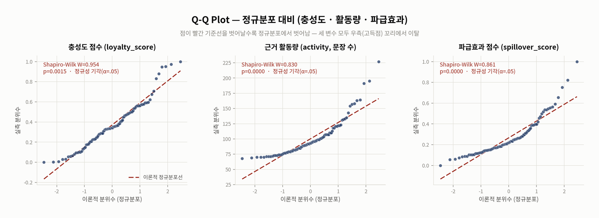
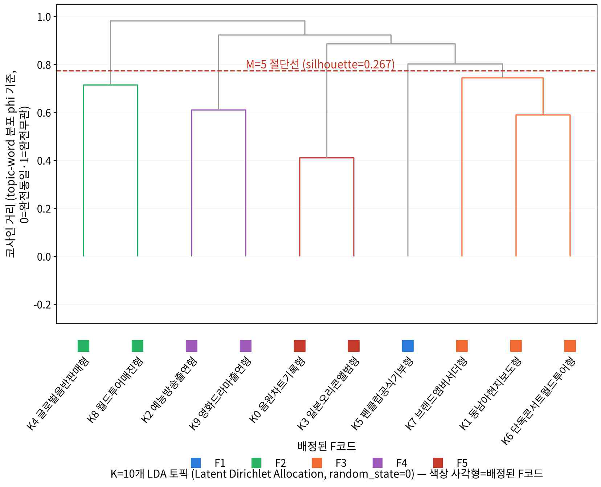

# 국내 대표 팬덤 100개 LDA 토픽모델링 — 팬충성도 × 파급효과 × 팬 요인 구조

> **핵심 요약판.** 「2026년 문화체육관광 통계 활용대회」 제출 보고서(`(분석보고서)…최종.pdf`, `(요약보고서)…최종.pdf`)의 최종 결과·대표 차트·모델 설명을
> 한 페이지로 압축했다. 라운드별 진행 이력은 생략하고, 저장소의 모든 수치는 `verify_v7_final_consistency.py`(101/101)와 R 교차검증(238/238)으로 파일에서 재현된다.

| 항목 | 내용 |
|---|---|
| 분석 대상 | 국내 대표 팬덤 100개 (K-pop 보이·걸그룹, 트로트, 솔로, 밴드, 원로그룹, 힙합 등) |
| 데이터 | 뉴스·위키·공식자료·커뮤니티 등 공개 웹 자료 기반 **근거 문장 10,020건** (14개 언어권, LDA 재적합 문서 10,018건) — `data/v7_final/fandoms_v3_100.json` |
| 핵심 모델 | **LDA 토픽(K=10) → 메타팩터(M=5) → 파급경로(F1∼F5) → 페르소나(4유형)** 4단계 해석 계층. 해석 계층은 실루엣 게이트를 통과한 **동결 스냅샷(v7-40, 7,350건, silhouette 0.267)** 에 고정 |
| 점수 | 근거문장별 EvidenceScore 합산 → min-max 정규화한 **팬충성도·파급효과**, 메타팩터 분포 엔트로피 **팬 요인 다양성**(3D 맵 Z축), 언어·시장·출처·시간·엔티티 가중합 **Coverage Index** |
| 보조지표 7종 | 광고·상업성 1,302건(13.0%) · 팬덤결속 923건(9.2%) · 미디어·콘텐츠 노출 1,025건(10.2%) · 매체 크로스오버 6,712건(67.0%, 매체 1,298개) · 국내 지역 · 멤버 집중도(MCI) · 세계 언어 — LDA와 무관한 원문 키워드·도메인 매칭 |
| 인터랙티브 산출물 | [`3D_포지셔닝맵_국내100팬덤.html`](3D_포지셔닝맵_국내100팬덤.html) (+`plotly-bundle.js`) · [`Persona_결정공간.html`](Persona_결정공간.html) · QR 코드 [`qr_codes/`](qr_codes/) |

---

## 1. 핵심 발견 3가지

1. **영향력의 크기보다 구조가 갈린다.** 팬충성도·파급효과 종합 점수와 Coverage Index·팬 요인 다양성은 서로 다른 것을 재며 같은 방향으로 움직이지 않는다. 단일 점수 순위보다 요인 구성의 다양성이 팬덤 간 차이를 더 잘 설명한다.
2. **선두는 근거가 쌓일 때마다 바뀌었다.** 파급효과 1위(BTS → TWICE → … → BTS), 팬충성도 1위(임영웅 → SEVENTEEN 등)가 라운드마다 교체됐다. 데이터를 조정한 결과가 아니라 새로 확인된 근거를 그대로 반영한 결과다.
3. **리서치를 늘려도 군집 안정성은 좋아지지 않았다.** 코퍼스가 1,781건→9,680건(+444%)으로 자라는 동안 K→M 재군집화의 실루엣은 0.058∼0.148을 등락했고 기준선 0.267에 한 번도 닿지 못했다(게이트 구간 20회 실측, 최종 보고서 시점 누적 **28회 연속 기각**). 그래서 해석 계층은 v7-40 스냅샷에 고정하고, 라이브 코퍼스는 보조지표에만 반영하는 **이원 구조**를 택했다.


*그림 1. 코퍼스 규모(막대) vs 메타팩터 실루엣(선). 게이트 구간(r46∼r66 2차)의 코퍼스–실루엣 상관은 r=+0.15로 사실상 무관하다. 재현: `v7_final_10020/silhouette_gate_policy/`*

---

## 2. 모델 구조



**지표 산식** (전체 정의와 검증: [`v7_final_10020/index_methodology/`](v7_final_10020/index_methodology/))

| 지표 | 식 | 저장소 재현 |
|---|---|---|
| EvidenceScore | Σ_t [1.0 + 0.5·n_num(t) + 0.3·n_kx(t)] — 문장당 기본 1점 + 수치표현 0.5 + 보너스 키워드(충성도 19·파급효과 18) 0.3 | 코퍼스에서 100/100 원점수 재현 |
| 팬충성도·파급효과 | 원점수의 표본 내 min-max 정규화 (0∼1) | 3D 맵 payload와 100/100 일치 |
| Coverage Index | 0.30·언어 엔트로피(ln 14) + 0.25·시장/6 + 0.20·출처유형/3 + 0.15·연도/12 + 0.10·엔티티/6 | 0/100 불일치 |
| 팬 요인 다양성 | −Σ pₘ ln pₘ / ln M — 메타팩터 비중 분포의 정규화 엔트로피 | 0/100 불일치 |
| 활동량 | 충성도 + 파급효과 근거문장 수 (합 10,020) | 0/100 불일치 |

**두 데이터 계층** — 같은 팬덤의 점수가 파일마다 다르게 보이는 이유

| 계층 | 코퍼스 | 이 계층에서 나온 수치 | 대표 파일 |
|---|---|---|---|
| 동결 스냅샷 v7-40 (해석 계층) | 7,350건 | K=10→M=5(실루엣 0.267), F1∼F5 비중, 페르소나 43/31/17/9, 전체 순위표 | `fandom_scores_v6.json`, `fan_persona_v7.json`, `lda_v6_diagnostics_frozen_v7_40.json` |
| 라이브 코퍼스 (최종) | 10,020건 | 팬충성도·파급효과 점수(평균 0.371/0.266), 4구획 24/17/10/49, 통계 검정, 보조지표 7종, 3D 맵 | `fandoms_v3_100.json`, `fandom_scores_live_reference_v7.json`, `chart3d_payload_live_reference_v7.json` |

---

## 3. 3D 포지셔닝 맵과 통계적 가설검정 (라이브 코퍼스 기준)


*그림 2. 100개 팬덤 3D 포지셔닝 맵 — X 파급효과 × Y 팬충성도 × Z 팬 요인 다양성. Z축은 영향력의 크기가 아니라 구조(화제가 여러 경로에 고르게 분포하는지)를 잰다.*

| 검정 | 결과 | 해석 |
|---|---|---|
| 정규성(Shapiro-Wilk) | 두 점수 모두 p<.05 | 정규분포 아님 → 순위 검정 병행 |
| Pearson r | **0.493** (p<.001, R²=0.243) | 설계 기준 \|r\|<0.5 충족 (동결 스냅샷은 미충족) |
| Spearman ρ | 0.380 (p<.001) | 방향·유의성 일치 |
| 다중회귀 R² (+활동량 통제) | 0.243 → **0.847** | 두 점수가 근거문장 수를 공통 기반으로 함 |
| 충성도 회귀계수 (+활동량 통제) | **−0.200** (p<.001) | 부호 반전 → 같은 근거 예산 안에서 트레이드오프 |
| VIF | 1.93 | 다중공선성 문제 없음 |
| 4분면 독립성 χ² (0.5 기준 2×2) | **8.34**, p=0.0039 | 두 축 독립 가정 기각 |
| Loyalty–Diversity / Spillover–Diversity | r=0.099 (n.s.) / **0.461** (p<.001) | Z축은 충성도와 독립, 파급효과와는 상관 |

영향점(Cook's D) 상위: BTS 0.575 · god 0.284 · 이효리 0.254 · TWICE 0.232 · BLACKPINK 0.094. 이효리는 충성도 0.006에 파급효과 0.654로 표준화 잔차 +3.59의 극단 사례다.


*그림 3. 팬충성도 × 파급효과 2D 포지셔닝 맵(제출 보고서 2-6절). 버블 크기는 근거문장 수다. 3절 표의 χ²는 이와 별도로 0.5 기준 2×2표([[7,17],[4,72]])로 계산한 값이다.*

**4구획 읽는 법.** 기준선은 100개 팬덤의 표본 평균이다(팬충성도 0.371, 파급효과 0.266). 두 축이 모두 평균 이상이면 **핵심전략형(24개)** 으로, 결속력과 파급력을 모두 갖춘 팬덤이며 BTS·TWICE·임영웅·Stray Kids·BLACKPINK가 여기 속한다. 충성도만 평균 이상이면 **내부결속형(17개)** 으로, 결속력은 높으나 외부로 퍼지는 파급력은 낮은 유형이다(SEVENTEEN·NCT·RIIZE·레드벨벳 등). 파급효과만 평균 이상이면 **외부견인형(10개)** 으로, 언론·브랜드가 먼저 끌어 주지만 팬덤 결속 근거는 상대적으로 적은 유형이다(NewJeans 등). 둘 다 평균 이하인 **주변부(49개)** 가 절반 가까이를 차지하는데, 이는 근거문장 수가 적은 팬덤이 두 점수 모두 낮게 나오는 구조와 맞물린다(두 점수 모두 활동량과 상관 0.69·0.90). 4구획은 통계적 군집이 아니라 평균선 기준의 규칙 분류이므로, 경계 근처 팬덤은 근거가 몇 건만 더해져도 구획이 바뀔 수 있다.



*그림 4. 충성도·활동량·파급효과의 Q-Q plot — 세 변수 모두 우측 꼬리에서 정규선을 벗어난다(Shapiro-Wilk p<.05). 통계량 전부는 `Statistics/R_통계검증/`(R)과 `Statistics/verify_r_sections_python.py`로 238/238 재현.*

---

## 4. 팬충성도 + 파급효과 상위 15개 팬덤 (동결 스냅샷)

| 순위 | 팬덤 | 팬충성도 | 파급효과 | 대표 요인 | 구획 |
|---|---|---|---|---|---|
| 1 | BTS | 0.93 | 1.00 | 현장경제형 | 핵심전략형 |
| 2 | TWICE | 0.94 | 0.85 | 현장경제형 | 핵심전략형 |
| 3 | 임영웅 | 0.90 | 0.70 | 현장경제형 | 핵심전략형 |
| 4 | Stray Kids | 0.81 | 0.70 | 현장경제형 | 핵심전략형 |
| 5 | BLACKPINK | 0.75 | 0.71 | 현장경제형 | 핵심전략형 |
| 6 | SEVENTEEN | 1.00 | 0.39 | 현장경제형 | 내부결속형 |
| 7 | 지드래곤 (G-Dragon) | 0.56 | 0.73 | 현장경제형 | 핵심전략형 |
| 8 | NCT | 0.71 | 0.48 | 현장경제형 | 내부결속형 |
| 9 | CORTIS | 0.53 | 0.63 | 현장경제형 | 핵심전략형 |
| 10 | aespa | 0.58 | 0.55 | 현장경제형 | 핵심전략형 |
| 11 | NewJeans | 0.43 | 0.59 | 현장경제형 | 외부견인형 |
| 12 | RIIZE | 0.63 | 0.38 | 현장경제형 | 내부결속형 |
| 13 | ATEEZ | 0.53 | 0.47 | 현장경제형 | 내부결속형 |
| 14 | 레드벨벳 | 0.71 | 0.29 | 현장경제형 | 내부결속형 |
| 15 | 아이유 | 0.64 | 0.36 | 현장경제형 | 내부결속형 |

---

## 5. K → F → 페르소나 해석 계층

| 계층 | 답하는 질문 | 정의 | 파일 |
|---|---|---|---|
| K (Topic) | 무엇을 하는가 | LDA 토픽 10개 (음원차트기록·해외현지보도·예능출연·글로벌음반판매·팬클럽공식활동·단독콘서트투어·브랜드앰버서더·미디어크로스오버 등) | `topic_cards_v7.json` |
| F (Impact Pathway) | 어디로 전이되는가 | 메타팩터 5개를 파급경로로 재명명 — F1 팬덤결속(Fan→Fan) · F2 직접소비(Fan→Market) · F3 현장경제(Fan→Event→Local) · F4 산업전이(Fan→Brand/Industry) · F5 대중·글로벌 확산(Fan→Media→Global) | `factor_pathway_map_v7.json` |
| Persona | 어떤 방식으로 작동하는가 | 상위 2개 F 조합 10가지 중 실현 4유형: **글로벌투어형 43**(F3+F5) · **현장상업형 31**(F3+F4) · **원정소비형 17**(F2+F3) · **집단동원형 9**(F1+F3) — 전부 F3 공유 | `fan_persona_v7.json` |
| Loyalty·Spillover | 얼마나 강한가 | 점수를 F별로 분해한 Factor-specific Impact = 비중 × 점수 | `fan_persona_v7.json` |

| Fan Persona Map | 경로별(F1∼F5) 점수 분해 |
|---|---|
|  |  |

| K→M 군집화 덴드로그램 | PCA 투영 (페르소나 결정공간) |
|---|---|
|  |  |

*그림 5∼7. 왼쪽 덴드로그램은 토픽 φ분포의 코사인 거리로 K=10을 M=5로 묶는 과정(실루엣 최대 M 자동 선택), 오른쪽 PCA는 페르소나를 결정하는 F1∼F5 비중 공간(PC1 40.8%, PC2 30.8%). 재현 노트북: `v7_final_10020/analysis/persona_decision_space/` (K→F 10/10, 페르소나 100/100, PCA 좌표 차이 5e-6).*

---

## 6. 보조지표 7종 (라이브 코퍼스 10,020건)

| 지표 | 무엇을 재나 | 산정 | 결과 요약 |
|---|---|---|---|
| 광고·상업성 지수 | 광고 계약·앰버서더·협찬 문장 비중과 20개 업종 구성 | 광고신호 키워드 31개 → 업종 사전 다중분류 | 1,302건(13.0%). 복지/행정 228 · 패션/의류 209 · 미용 177 · 식음료 169 · 정보/통신 94 |
| 미디어·콘텐츠 노출 지수 | 예능·유튜브·영화·드라마 노출 | 4개 서브태그 키워드 매칭 | 1,025건(10.2%), 99/100 팬덤 (투어스 0건) |
| 팬덤결속 지수 | 조직적 결속력 5유형(A 공식팬클럽 · B 팬카페 · C 정체성 · D 기부 · E 오프라인 결집) | 유형별 키워드 매칭 | 923건(9.2%), 상위 임영웅·김재중·김호중·이찬원·정동원 |
| 매체 크로스오버 지수 | 매체 확산 폭 | 출처 URL의 뉴스 도메인 수 | news_media 6,712건, 서로 다른 매체 1,298개 |
| 국내 지역 지수 | 17개 시/도 밀착도 | 지역명 텍스트마이닝 | 지역 언급 1,226건, 검출 469, 99/100 팬덤. 서울 편중 뚜렷, 다양성 1위 임영웅(12지역, 0.71) |
| 멤버 집중도 MCI | 그룹 내 멤버 쏠림 | Σ(멤버 점유율)² (허핀달 방식, 하한 1/멤버수) | 45개 그룹. MCI∼멤버 수 r=−0.728, 멤버 수 통제 후 outcome 설명력 R²<0.05 |
| 세계 언어 지수 | 해외 확산 | Coverage의 언어 분포 재구성 | 해외언어 4,469건(44.6%), 100/100 팬덤. 영어 2,195(49.1%) · 일본어 · 중국어 순 |

| 해외언어별 근거 순위 | 팬덤별 해외언어 구성 (상위 20, Worldwide Language Pilot) |
|---|---|
|  |  |

| 미디어·콘텐츠 노출 (상위 20) | 팬덤결속 지수 (유형별 순위 · 상위 25) |
|---|---|
|  |  |

| 국내 지역 언급 순위 | 업종별 광고·상업성 순위 |
|---|---|
|  |  |


*그림. 팬덤별 광고·상업성 업종 구성(상위 25) — 20개 업종 누적 막대, 팬덤 내 다중분류 포함.*

**MCI 상위·하위와 설명력** (`member_mention_index_v7.json`, 상관은 상세 보고서 7.4절 표)

| 그룹 | 멤버 언급 | 상위 멤버(점유율) | MCI |
|---|---|---|---|
| FTISLAND | 23 | 이홍기 0.78 · 이재진 0.22 | 0.660 |
| 동방신기 | 33 | 유노윤호 0.58 · 최강창민 0.42 | 0.512 |
| CNBLUE | 24 | 정용화 0.67 · 강민혁 0.21 · 이정신 0.13 | 0.504 |
| … | | | |
| SEVENTEEN | 68 | 승관 0.15 · 버논 0.15 · 조슈아 0.13 | 0.112 |
| NCT | 61 | 마크 0.16 · 도영 0.15 · 윈윈 0.15 | 0.111 |

원시 MCI가 가장 잘 설명하는 outcome은 팬충성도(r=−0.385, R²=0.148)지만, 멤버 수를 뺀 MCI_excess로는 어떤 outcome도 유의하지 않다(최대 R²=0.046). MCI는 집중도보다 멤버 수를 대리하는 지표에 가깝다.

---

## 7. 토크나이저와 언어(문자권)별 워드클라우드

`tokenize(text, url)`은 2단 구조다. **일반 경로**(정규식 + 언어별 불용어)가 모든 문장에 먼저 적용되고, 본문에 가나·한자·태국 문자가 실제로 있을 때만 **fugashi(일본어)·jieba(중국어)·pythainlp(태국어)** 형태소 분석 결과를 위에 얹는다. 출처 도메인 태그가 아니라 본문 문자로 분기하는 이유는, 일본·중국 매체를 인용한 문장 대다수가 한국어 요약문이라 태그 기준 분기가 콘텐츠를 날려 버렸기 때문이다.

| 문자권 | 불릿 수 | 토큰 총계 | 어휘 종수 |
|---|---:|---:|---:|
| 한국어 | 8,942 | 134,027 | 21,279 |
| 영어 | 6,425 | 32,332 | 7,226 |
| 중국어 | 398 | 1,816 | 1,211 |
| 일본어 | 155 | 895 | 549 |
| 러시아어 | 45 | 471 | 367 |
| 비영어(라틴) | 219 | 470 | 338 |
| 태국어 | 56 | 411 | 278 |
| 베트남어 | 30 | 303 | 205 |


*그림 15. 10,020건 전체에 토크나이저를 실제 실행한 결과(토큰 170,725개, `wordcloud_by_language_v7.json`). 언어별 불용어 목록은 `v7_final_10020/analysis/tokenizer/stopwords/`, 보고서 전문은 `v7_final_10020/tokenizer_wordcloud_report/`.*

---

## 8. 한계 및 결론

- 전수조사가 아니라 뉴스·위키·공개 커뮤니티 표본이며, SNS는 2차 보도로만 반영된다.
- 해석 계층(K→F→페르소나, 전체 순위표)은 v7-40 스냅샷(7,350건)에 고정되어 있고, 로스터 교체 3건(BE'O→빈지노 · 한로로→몬스타엑스 · pH-1→투어스)을 포함한 라이브 코퍼스는 보조지표에만 반영된다.
- 판별타당도(|r|<0.5)와 Z축 독립성은 스냅샷에 따라 결론이 뒤집혔다. 단일 스냅샷만으로 통계적 결론을 확정하기 어렵다는 근거다.
- 보조지표는 사전에 없는 표현(다큐멘터리·라디오, 사전 밖 브랜드명)을 포착하지 못하고, MCI는 멤버 수가 적을수록 구조적으로 높다.
- 그럼에도 다중회귀·4구획·민감도 분석의 트레이드오프 구조는 두 스냅샷 모두에서 같았다. 팬덤 영향력은 **크기(점수)와 구조(요인 다양성·경로)를 함께** 봐야 한다는 것이 이 분석의 결론이다.

---

## 9. 저장소 안내

**재현 명령 (저장소 루트, Python 3.10+; scipy·statsmodels·scikit-learn·pandas·matplotlib, 토크나이저는 fugashi unidic-lite jieba pythainlp)**

```bash
python verify_v7_final_consistency.py                                        # 보고서 수치 ↔ data/v7_final 101/101
python Statistics/verify_r_sections_python.py                                # 통계 검정 238개 항목 (R 패키지와 같은 정답지)
python v7_final_10020/index_methodology/build_index_calculation_notebook.py  # 식(1)~(7) 지표 산정 노트북
python v7_final_10020/analysis/build_notebooks_v7.py                          # 보조지표·페르소나·토크나이저 노트북 8개
python v7_final_10020/analysis/persona_decision_space/build_persona_decision_space_notebook.py
```

**저장소에 없는 것**: 최종 참고 재적합을 만든 14개 언어 라우팅 토크나이저(`run_lda_v6_live_reference_v7.py`), 동결 스냅샷의 φ·코사인 거리 행렬(`factor_clustering_structure_v7.json`), 동결 7,350건 코퍼스. 저장소의 `run_lda_v6.py`는 이전 판 토크나이저의 파이프라인이라 10,020건에서 문서 수 9,954건으로 보고서와 다르며 로직 참고용이다. 같은 방법을 최종 코퍼스에 적용한 φ·코사인 거리 산출물은 `v7_final_10020/analysis/persona_decision_space/topic_phi_cosine/`에 있다.

```
README.md                                   이 문서 (핵심 요약판)
(분석보고서)…최종.pdf, (요약보고서)…최종.pdf  제출본
3D_포지셔닝맵_국내100팬덤.html + plotly-bundle.js / Persona_결정공간.html   인터랙티브 산출물 (같은 폴더에서 열면 동작)
qr_codes/                                   두 HTML의 QR 코드 + 아티팩트 링크·해시 대조
assets/readme/                              이 문서의 그림 17장 (제출 보고서 PDF·핵심 요약판 docx 원본 그림, 가로 최대 2,400px)
verify_v7_final_consistency.py              최종 수치 ↔ 파일 정합성 검증 (101/101)
run_lda_v6.py                               LDA 파이프라인 참고 구현 (--data/--out)
data/
  v7_final/            최종 코퍼스 10,020건 + 최종 산출물 + 동결 스냅샷 산출물 (폴더 README)
  v7_rounds/           v6 단계 로그 3개 + v7 병합·교체 로그 전량 (마지막 r72가 10,020건)
  silhouette_gate_timeline/  실루엣 게이트 타임라인 CSV (v4 종료~r66 2차)
v7_final_10020/        ★ 10,020건 기준 문서·코드·노트북 전부 (폴더 README)
  docs/                  KEY_FINDINGS · METHODOLOGY · FINAL_REPORT_SUMMARY · PYTHON_CODE_SUMMARY · REPORT_DOCX_VERIFICATION
  analysis/              보조지표 7종·Fan Impact Pathway·토크나이저 노트북 8개 + 문서, 페르소나 결정공간 노트북(+φ·코사인 거리 산출),
                         토크나이저 스크립트·불용어 정리(stopwords/), 기술 상세명세서, 국내 지역 지수 JSON/CSV
  index_methodology/     지표 산식 문서 + 식(1)~(7) 산정 노트북(ipynb + Spyder용 .py) + 재검증 스크립트
  charts/ indices_csv/ data_export/   그림·지수 CSV·데이터 추출 스크립트 (출력은 output/)
  silhouette_gate_policy/  tokenizer_wordcloud_report/  report_scripts/
Statistics/R_통계검증/  보고서 2.1·2.2·3.8·7.4절 통계량을 R 표준 함수로 재계산 (238/238, RUN_ALL.R 하나로 실행)
Statistics/verify_r_sections_python.py   같은 238개 항목의 파이썬 판
archive/v6_r22_era_backup.zip   최종 코퍼스 확정 이전(v7 r22, 5,612건) 시점 자료 백업 — 본문은 참조하지 않음
```

**검증 상태**: 파이썬 26개 컴파일 · 노트북 10개 실행 오류 0 · 스크립트 22개 실행 및 재실행 산출물 동일 · 보고서 docx 대조 47/58 수치 일치(문장 오기 12건은 `REPORT_DOCX_VERIFICATION.md`).
