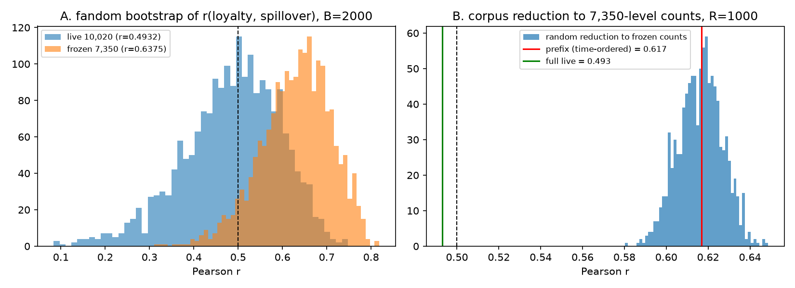

# 부트스트랩 신뢰구간과 코퍼스 축소 반복 (L10)

판별타당도(|r|<0.5)와 Z축 독립성은 동결(7,350건)과 라이브(10,020건)에서 결론이 반대였다. 이 문서는 그 차이에 불확실성 폭을 붙인다. 전부 `bootstrap_ci_v7.py`(seed 0)가 만든다.

## 0. 결론

1. **판별타당도 r의 95% CI는 두 스냅샷 모두 0.5를 포함한다.** 라이브 r = 0.4932 (CI [0.2453, 0.6667]), 동결 r = 0.6375 (CI [0.4606, 0.7653]). 팬덤을 다시 뽑으면 라이브에서 |r|<0.5 인 비율이 52%, 동결에서 6%다. '충족/미충족'은 100개 팬덤 표본에서 확정할 수 있는 결론이 아니다.
2. **두 스냅샷의 r 차이는 유의하다.** 공통 97개 팬덤의 짝지은 부트스트랩에서 r(동결) − r(라이브) = 0.1261 (CI [0.0287, 0.2401], 양수 비율 99.7%). 차이는 표본 잡음이 아니라 코퍼스 차이다.
3. **차이의 대부분은 팬덤별 불릿 건수 구조에서 온다.** 라이브 문장을 동결 시점의 팬덤별 건수만큼 무작위로 줄이기만 해도 r은 평균 0.6163 (CI [0.596, 0.6365])으로 동결 값(0.6375) 쪽으로 옮겨가고, 0.5 이상인 비율이 100.0%다. 시간순 앞부분 축소(동결 근사 복원본과 같은 축소)의 r = 0.6168도 무작위 분포의 한가운데(이 값 이상 49.7%)라, '어느 문장이 들어갔는가'는 거의 영향이 없다. 점수가 EvidenceScore 합의 min-max 라 팬덤별 건수가 점수를 좌우하기 때문이다(건수 ↔ 점수 r: 라이브 충성도 0.9035, 파급효과 0.9596; 팬덤별 충성도·파급효과 건수 간 r: 동결 0.6501, 라이브 0.5379). 동결 시점에는 팬덤별 충성도·파급효과 수집 건수가 더 같이 움직였고, r41∼r72의 추가 2,670건이 그 짝을 풀어 r을 0.4931까지 내렸다. 판별타당도 결론은 수집 배분(L12 조사 노출량)의 함수다.
4. **Z축 독립성**: factor_diversity ~ loyalty + spillover 의 R²는 라이브 0.2341 (CI [0.1305, 0.3808]), 동결 0.0112 (CI [0.0009, 0.1057]). 계수 부호가 재표본에서 유지되는 비율은 아래 표.

## 1. 팬덤 부트스트랩 (B = 2,000)

| 통계량 | 라이브 점추정 | 라이브 95% CI | 동결 점추정 | 동결 95% CI |
|---|---|---|---|---|
| Pearson r(충성도, 파급효과) | 0.4932 | [0.2453, 0.6667] | 0.6375 | [0.4606, 0.7653] |
| Spearman ρ | 0.3796 | [0.1909, 0.5461] | 0.5543 | [0.3803, 0.6991] |
| spillover ~ loyalty + activity: loyalty 계수 | -0.1996 | [-0.3209, -0.0802] | -0.3136 | [-0.4769, -0.1438] |
| 같은 회귀: activity 계수 | 0.0064 | [0.0056, 0.0071] | 0.0087 | [0.0076, 0.0099] |
| diversity ~ loyalty + spillover: loyalty 계수 | -0.073 | [-0.1743, 0.0299] | 0.0267 | [-0.0438, 0.0937] |
| 같은 회귀: spillover 계수 | 0.3008 | [0.1915, 0.4374] | -0.043 | [-0.1296, 0.0462] |
| 같은 회귀 R² | 0.2341 | [0.1305, 0.3808] | 0.0112 | [0.0009, 0.1057] |
| 4분면 χ² p | 0.0039 | [0.0, 0.6403] | 0.0014 | [0.0, 0.3639] |

| 비율 | 라이브 | 동결 |
|---|---|---|
| \|r\|<0.5 (판별타당도 충족) | 0.5175 | 0.0585 |
| 4분면 χ² p<0.05 | 0.7875 | 0.845 |
| diversity 회귀 loyalty 계수 < 0 | 0.917 | 0.2265 |
| diversity 회귀 spillover 계수 > 0 | 1.0 | 0.176 |

공통 97개 팬덤 짝지은 부트스트랩: r(동결) 0.6157 − r(라이브) 0.4896 = 0.1261, CI [0.0287, 0.2401].

## 2. 코퍼스 축소 반복 (R = 1000)

| 구분 | r |
|---|---|
| 라이브 전체 (문장 점수에서 재계산) | 0.4931 |
| 시간순 앞부분 축소 (= 동결 근사 복원본) | 0.6168 |
| 동결 스냅샷 저장값 | 0.6375 |
| 무작위 축소 평균 (sd) | 0.6163 (0.0105) |
| 무작위 축소 95% 구간 | [0.596, 0.6365] |
| 무작위 축소 중 r ≥ 0.5 비율 | 1.0 |
| 무작위 축소 중 r ≥ 시간순 축소값 비율 | 0.497 |

| 건수 구조 진단 | 라이브 | 동결 |
|---|---|---|
| r_counts(n_loyalty, n_spillover) | 0.5379 | 0.6501 |
| r(loyalty_score, n_loyalty) | 0.9035 | 0.9449 |
| r(spillover_score, n_spillover) | 0.9596 | 0.956 |

축소 목표 건수는 동결 점수 파일의 팬덤별 n_loyalty/n_spillover(97개)이고, 동결 이후 진입한 빈지노·몬스타엑스·투어스는 7,350/10,020 비율로 줄였다. 점수는 문장 단위 EvidenceScore(`index_methodology/evidence_score_by_sentence_v7.csv`) 합의 min-max 정규화라 원 파이프라인과 같다(L5). factor_diversity는 LDA 문서-토픽 분포가 필요해 축소 반복에서는 다루지 않는다.

## 3. 한계
1. 팬덤 부트스트랩은 100개 팬덤을 모집단의 표본으로 보는 가정이다. 팬덤 100개는 임의 표본이 아니라 선정된 집합이므로 CI는 '이 선정 방식 아래의 표본 변동'으로 읽는다.
2. 축소 반복은 문장을 무작위로 뺀다. 실제 수집은 시간순·라운드별 주제 편중이 있으므로(bullet_provenance_v7.csv), 시간순 축소값과 무작위 분포의 거리가 그 편중의 크기다.
3. R 쪽 `plots.R`에 CI 띠를 넣는 일은 하지 않았다(이 환경에 R이 없음). 값은 `bootstrap_ci_v7.json`에 있다.

## 4. 파일
| 파일 | 내용 |
|---|---|
| `bootstrap_ci_v7.json` | A(라이브·동결 부트스트랩 CI·비율), A_paired(97개 공통 차이), B(축소 반복) |
| `bootstrap_r_distributions_v7.png` | r 분포 두 패널 |
| `bootstrap_ci_v7.py` | 이 문서를 만드는 스크립트 |

