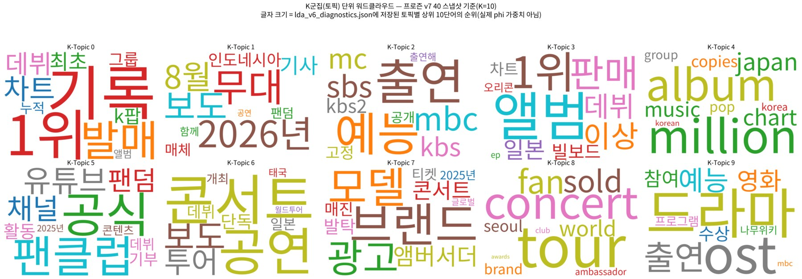
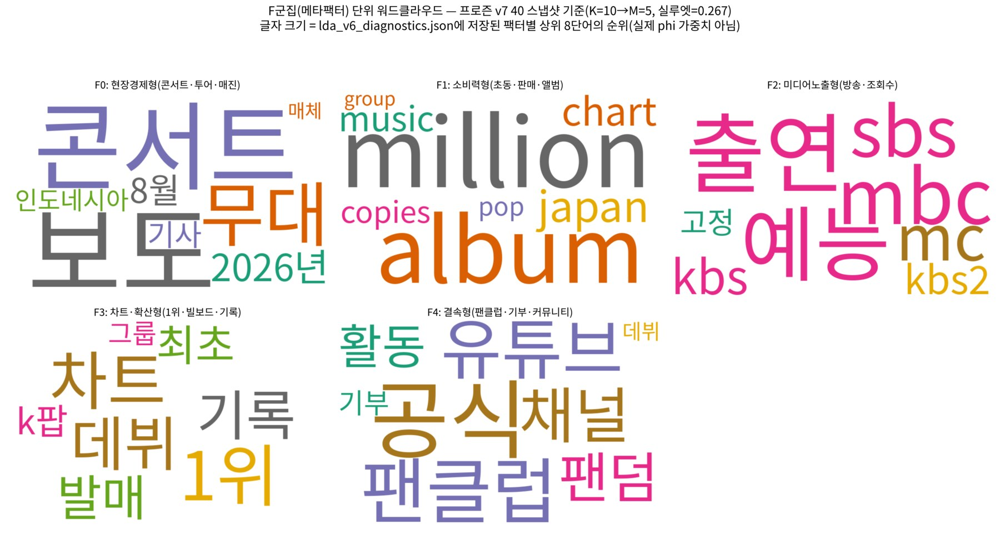
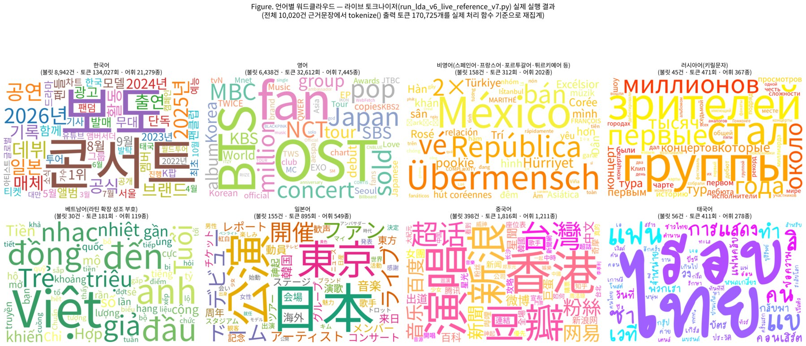

# 팬덤 텍스트 분석 결과 보고서 (v7) — 별도 보고서

**토크나이저 사용 현황 정리 + 언어(문자권)별 워드클라우드**

문서화·시각화 전용 (코퍼스·토크나이저 코드 변경 없음) · 2026년 9월

> **이 문서의 위치:** 최종 보고서(팬덤100_LDA_v7_보고서.docx) 7.7절과 같은 내용을 별도
> 보고서로 정리한 것이다. 본문의 수치는 최종 근거 코퍼스 10,020건 전체에 실제 토크나이저를
> 실행한 결과이며, 이미지 3장은 `assets/tokenizer_report/`에 있다(용량 때문에 원본 PNG를 JPG로
> 리사이즈했으며 내용은 동일).
>
> 표 2의 원본 실행 결과는 `data/v7_final/wordcloud_by_language_v7.json`(총 토큰 170,725개,
> 8개 버킷별 불릿 수·토큰 수·상위 30단어)에 있다. 한국어 8,942·중국어 398·일본어 155·태국어 56·
> 러시아어 45·베트남어 30은 표 2와 동일하고, 영어 6,425·비영어 219는 표 2(6,438/158)와 다른데,
> 파일의 `methodology` 필드대로 wordfreq 재검증으로 순수 ASCII 토큰 219개를 비영어로 재분류한
> 후속판이기 때문이다. 재적합 제외 2건은 `lda_excluded_bullets_v7.json`(→ 10,018건).
>
> 7절의 "본문 문자 실측 기반 분기" 로직을 저장소만으로 독립 재현한 노트북은
> `v7_final_10020/analysis/tokenizer/tokenizer_script_routing_v7.ipynb`, 토큰 빈도 CSV는 같은
> 폴더의 `build_bullet_token_frequency_csv_v7.py`다(불용어 목록은 독자 정의 — 아래 "재현 범위" 참고).

---

**사용자 요청 원문:** "토크나이저 사용 관련한 내용을 정리하고, 워드클라우드도
함께 정리해서 보고서에 넣어주고, (요약서가 아닌) 별도 보고서로 워드 하나만
같이 해서 보여줘." 지금까지 토크나이저 관련 수정(v7 38·76·77라운드 등)이
원본 상세 보고서 3.9절 곳곳에 라운드별로 흩어져 있어, 이 문서는 새 코드
변경 없이 "현재 실제로 동작 중인 토크나이저가 정확히 무엇을 하는지"를 한
곳에 모아 정리하고 그 결과를 워드클라우드로 시각화한다. 이 작업 자체는
코퍼스도 tokenize()/language_of() 코드도 전혀 바꾸지 않으므로 새 "라운드"
번호를 부여하지 않고 "실루엣 게이트" 재시험도 하지 않는다(게이트 정책은
어휘·언어분류에 실제 영향을 주는 변경에만 적용된다). 원본 상세 보고서
(팬덤100_LDA_v7_보고서.docx) 7.7절에 동일한 내용이 실려 있다 — 요약서
(별도보고서)에는 반영하지 않았다(사용자 요청 범위).

---

## 1. 토크나이저 구조 개요 — "일반 경로" + "문자권별 추가 경로"

`tokenize(text, url)` 함수는 두 층으로 이뤄진다. 먼저 인용 출처 도메인
표기(natalie.mu, oricon.co.jp 등)가 본문에 그대로 섞여 무의미하게 쪼개지는
것을 막기 위해 도메인 패턴을 토큰화 이전에 제거한다(`strip_domain_fragments`).
그다음 "일반 경로"(`tokenize_generic`)를 항상 먼저 실행한다 — 한국어·영어·
스페인어·프랑스어·포르투갈어·인도네시아어·베트남어·튀르키예어·러시아어 등
공백으로 단어를 구분하는 모든 언어를 정규식 하나로 함께 처리하는 경로다.
마지막으로 해당 불릿 "본문 자체"에 가나·한자·태국 문자가 실제로 등장하는
경우에만 일본어(fugashi)·중국어(jieba)·태국어(pythainlp) 전용 형태소 분석기
결과를 일반 경로 결과 위에 추가로 얹는다 — 이 세 언어는 띄어쓰기로 단어를
구분하지 않아 정규식 방식으로는 사실상 콘텐츠를 놓치기 때문이다(2절 표 참고).

## 2. 언어권별 처리 방식 상세

| 처리 경로 | 언어(권) | 불용어·형태소 처리 방식 (도입 라운드) |
|---|---|---|
| 일반 경로 (정규식 + 조사 접미사 제거) | 한국어 | STOPWORDS(자체 정의 기능어 41종) + PARTICLES(조사 접미사 제거, "그 자체가 독립 토큰"인 조사는 STOPWORDS에 별도 등재 — v7 38라운드, "에서"·"따르면"·"만에" 등 bare-token 누출 수정) |
| 일반 경로 | 영어 | ENGLISH_STOPWORDS(64종) — v6.1 최초 도입 |
| 일반 경로 | 스페인어·프랑스어·포르투갈어·인도네시아어·베트남어·튀르키예어·필리핀어 (7개 언어) | 언어별 전용 불용어 세트를 개별 정의한 뒤 ALL_LATIN_STOPWORDS로 합쳐 한 번에 적용 — 어느 불릿이든 8개 언어권 불용어를 동일하게 검사한다(코드스위칭 대응, v7 38라운드 신설) |
| 일반 경로 | 러시아어 | RUSSIAN_STOPWORDS(키릴 문자 전용) — v7 38라운드 신설, 라틴 확장·베트남어 확장과 함께 문자 클래스 자체도 키릴 범위(Ѐ-ӿ)까지 확장 |
| 형태소 분석기 추가 경로 | 일본어 | fugashi(MeCab+unidic-lite)로 형태소 분리 후 명사·동사·형용사만 채택 + JAPANESE_STOPWORDS(28종, v7 76라운드 신설 — "する"·"いる"·"こと" 등 단순 행위동사·형식명사 제거) |
| 형태소 분석기 추가 경로 | 중국어 | jieba로 단어 분리 후 CHINESE_STOPWORDS(60여종) 제외, 한자 미포함 토큰 제거 |
| 형태소 분석기 추가 경로 | 태국어 | pythainlp(newmm 엔진)로 단어 분리 후 내장 태국어 불용어 제외, 태국 문자 미포함 토큰 제거 |

*[표 1] 언어권별 토크나이저 처리 방식 — 모두 v7 38라운드에서 전면 확장,
일본어 불용어만 v7 76라운드에 추가 보강*

이 외에 (1) 토큰 정규식 자체를 ASCII 라틴에서 라틴 확장·베트남어 확장·
키릴 문자까지 포함하도록 넓혀 악센트·성조 부호가 있는 단어가 잘려나가지
않게 했고(원인3, v7 38라운드), (2) 순수 숫자 토큰은 무의미하므로 제외하며,
(3) 가나와 한자가 모두 있는 불릿(=사실상 일본어 문장)은 fugashi만 실행하고
jieba는 건너뛰도록 해 이중 토큰화를 막았다(원인7, v7 76라운드) — 한자만
있고 가나가 없는 진짜 중국어 불릿은 이 변경으로 영향받지 않는다.

## 3. "출처 도메인 태그" 대신 "본문 문자"로 언어 분기하는 이유

일본어·중국어·태국어 형태소 분석기를 어떤 불릿에 적용할지는
`language_of(url, text)`의 출처 매체 언어 태그가 아니라, 불릿 "본문" 안에
그 문자 체계(가나·한자·태국 문자)가 실제로 등장하는지로 판단한다. 처음엔
`language_of()` 태그로 분기하도록 짰으나, 실제 코퍼스를 검증하는 과정에서
"일본·중국·태국 매체를 인용한 불릿의 대다수가 사실은 한국어 문장으로 그
매체의 보도 내용을 요약한 것"임을 발견했다 — 예를 들어 대만 매체(zh)로
분류된 불릿이 본문은 100% 한국어인 경우가 흔했다. `language_of()` 태그
기준으로 분기하면 이런 순수 한국어 문장이 통째로 jieba/fugashi/pythainlp로
넘어가 콘텐츠를 사실상 날려버리는 회귀가 실측으로 확인됐다(zh 태그 문서의
평균 토큰 수가 3.40개로 붕괴 — 본문 문자 실측 방식으로 바꾸자 17.88개로
정상화). 그래서 "언어 태그"가 아니라 "실제 그 문자가 있는지"로 바꾸고,
항상 기존 일반 경로 위에 추가(additive)로만 얹는다 — 한국어 위주 불릿은
그대로 두고, 실제 외국어 문장이 섞인 경우에만 그 부분을 더 얹는 방식이다.

## 4. 매체명 자기인용 토큰 배제 (v7 77라운드) — 요약

일반 경로는 추가로, 그 불릿이 인용한 출처(`u` 필드) 자신의 도메인에서
매체명 슬러그(예: nautiljon.com→"nautiljon", detik.com→"detik"+"detikcom")를
프로그램적으로 추출해, 그 불릿 안에서만 일치하는 토큰을 걸러낸다
(`self_citation_slugs`). 전역 매체명 하드코딩 목록은 전혀 쓰지 않는다 —
다른 불릿에서 같은 매체명이 "제3자 인용"으로 등장하면(자기인용이 아니므로)
걸러내지 않는다. 전체 코퍼스 중 811건(8.1%)에서 최소 1개 자기인용 토큰이
이 방식으로 제거된다. 원본 상세 보고서 3.9.29절에 배경·검증 상세가 실려
있다.

## 5. 두 트랙(프로즌 vs 라이브)의 토크나이저 코드 동기화 상태

`run_lda_v6.py`(프로즌 — 코퍼스는 v7-40 스냅샷에 고정)와
`run_lda_v6_live_reference_v7.py`(라이브)는 `tokenize()` 등 토크나이저 함수
정의 자체는 v7 77라운드부터 완전히 동기화돼 있다. 다만 "코드가 같다"와
"저장된 적합 결과(K·M·토픽별 대표 단어)가 같다"는 별개다 —
`lda_v6_diagnostics.json`(프로즌, K=10·M=5·실루엣=0.267)은 v7-40 시점에 한
번 계산된 뒤 그대로 보존된 스냅샷 값이며, 이후의 코드 동기화만으로 자동
재계산되지 않는다 — 아래 6절 워드클라우드 작업 중 이 스냅샷을 현재
동기화된 코드로 실제로 재현해 보니 재현되지 않는다는 사실을 확인했다
(정직하게 아래에 기록·대응).

## 6. 시각화 ① — 프로즌 K토픽·F메타팩터 워드클라우드 (v7-40 스냅샷 기준)

> **정직한 발견과 대응:** 기존 `build_wordclouds_v6.py`(v7 20라운드 작성, 원 파이프라인 스크립트로
> 저장소 미포함)를 재실행해보니 이미 프로즌 스냅샷과 어긋나 있었다 — 그 스크립트는
> 당시 K=8을 2행4열 그리드에 하드코딩했는데, 지금의 `diag["selected_k"]`는
> 10이라 인덱스 오류로 실행 자체가 멈췄다. 원인을 규명하려고
> `run_lda_v6.py`(라이브와 동기화된 프로즌 코드)의 실제 `tokenize()`를
> 마커 기반 `exec()`로 재사용해 동일 코퍼스
> (`_snapshot_v7_40_reconstructed.json`)·동일 벡터라이저·LDA 파라미터
> (`random_state=0` 등)로 재적합을 시도했으나, `lda_v6_diagnostics.json`의
> `topics_top_words`와 10개 토픽 중 단 하나도 일치하지 않았다(0/10) —
> 코퍼스 재구성본이 실제 산출 시점과 완전히 같지 않거나 이후 코드 동기화가
> 토큰화 결과를 바꿨을 가능성이 있다. 새로 적합해 "그럴듯하지만 검증되지
> 않은" 가중치를 내놓는 대신, 이 프로젝트의 반허구화 원칙에 따라 재적합을
> 포기했다 — 대신 `lda_v6_diagnostics.json`에 이미 저장되어 있고 원본 상세
> 보고서 3장 표에도 그대로 쓰이는 순위 목록(토픽별 상위 10단어, 팩터별
> 상위 8단어)을 그대로 가져와 순위 역순 점수(1위가 가장 큼)로 워드클라우드
> 글자 크기를 매겼다 — 실제 phi 확률 가중치가 아니라 순위 기반 근사라는
> 점을 분명히 밝힌다.

*[그림 1] K군집(토픽) 단위 워드클라우드 — 프로즌 v7-40 스냅샷 기준(K=10),
`lda_v6_diagnostics.json`에 저장된 토픽별 상위 10단어의 순위 기반 시각화
(실제 phi 가중치 아님)*

*[그림 2] F군집(메타팩터) 단위 워드클라우드 — 프로즌 v7-40 스냅샷 기준
(K=10→M=5, 실루엣=0.267), 팩터별 상위 8단어의 순위 기반 시각화*

## 7. 시각화 ② — 언어(문자권)별 워드클라우드 (현재 라이브 토크나이저 실제 실행 결과)

`build_wordclouds_by_language_v7.py`가 `run_lda_v6_live_reference_v7.py`의
`tokenize_generic()`/`tokenize_ja()`/`tokenize_zh()`/`tokenize_th()` 정의를
마커 기반 `exec()`로 그대로 재사용해(재구현 없음,
`media_crossover_index_v7.json`과 동일 패턴), 현재 라이브 코퍼스 전체
10,020건에 실제로 이 코드를 실행했다 — 출력 토큰 170,725개를 얻었다.
일본어·중국어·태국어 버킷은 `tokenize()` 자신의 실제 if/elif 분기(가나가
있으면 `tokenize_ja()`, 아니면 한자가 있으면 `tokenize_zh()`, 태국 문자가
있으면 `tokenize_th()` — 1절)를 그대로 재현해 "그 함수가 실제로 실행됐는지"를
기준으로 나눴다 — [정정] 최초 게시본은 일본어·중국어까지 토큰 문자
(가나·한자) 유무로 사후 재분류했는데, 사용자가 "가나 한자로 나누지 말고
실제 언어기준으로 나눠달라"고 지적해 확인해보니 `tokenize_ja()`가 만드는
순수 한자 일본어 단어(예: "日本"·"東京"·"公演")가 가나가 없다는 이유로
중국어 버킷에 잘못 섞여 있었다 — 이번에 실제 처리 함수 기준으로 바로잡았다.
한국어·영어·비영어·러시아어·베트남어(모두 `tokenize_generic()` 출력)는 이
함수 자체가 8개 라틴어권·러시아어를 구분하지 않고 한 번에 처리하므로 "실제
함수 기준"이라는 대안이 없어, 사용자 요청에 따라 토큰 문자 기준으로 사후
재분류했다 — 한글이면 한국어, 키릴 문자가 있으면 러시아어(키릴문자), 라틴
확장 추가 대역(이 코퍼스에서는 사실상 베트남어 성조 결합 문자 전용)이
있으면 베트남어, 그 외 악센트 부호가 있는 라틴 확장 문자면 비영어(스페인어·
프랑스어·포르투갈어·튀르키예어 등), 순수 ASCII 라틴 문자면 영어로
판단했다(인도네시아어·필리핀어처럼 악센트 없는 언어의 단어는 이 방식으로
영어에 섞일 수 있다는 한계가 있다) — [추가 정정] 최초 게시본은 러시아어를
별도 분리하지 않고 비영어 버킷에 합쳐뒀는데, 사용자가 "비영어 그룹에서
러시아어(키릴문자)와 아랍어(아랍문자)는 분리해서 클라우드를 만들어달라"고
요청해 두 버킷을 분리했다가, 이후 "아랍어를 빼고 비영어에서 베트남어를
빼와서 그 자리에 넣어달라"는 요청에 따라 아랍어 패널을 제거하고 베트남어
패널로 대체했다.

| 문자권 | 불릿 수(1건 이상) | 비중 | 토큰 총계 | 어휘 종수 |
|---|---:|---:|---:|---:|
| 한국어 | 8,942 | 89.2% | 134,027 | 21,279 |
| 영어 | 6,438 | 64.3% | 32,612 | 7,445 |
| 비영어(스페인어·프랑스어·포르투갈어·튀르키예어 등) | 158 | 1.6% | 312 | 202 |
| 러시아어(키릴문자) | 45 | 0.4% | 471 | 367 |
| 베트남어(라틴 확장 성조 부호) | 30 | 0.3% | 181 | 119 |
| 일본어 | 155 | 1.6% | 895 | 549 |
| 중국어 | 398 | 4.0% | 1,816 | 1,211 |
| 태국어 | 56 | 0.6% | 411 | 278 |

*[표 2] 언어(문자권)별 tokenize() 출력 토큰 집계 — 현재 라이브 코퍼스 전체
실행 결과*

*[그림 3] 언어(문자권)별 워드클라우드 — 라이브 토크나이저 실제 실행 결과
(글자 크기 = 실제 등장 횟수)*

> **정직한 해석 유의사항:** 일본어(토큰 895회)·비영어(312회)·러시아어
> (471회)·베트남어(181회)·태국어(411회) 버킷은 표본이 한국어·영어 대비
> 훨씬 작아 워드클라우드가 시각적으로 빈약해 보일 수 있다 — 이는 "0건
> 확인"이 아니라 실제로 소량이라는 정직한 관찰이며, 원본 상세 보고서 7.6절
> Worldwide Language Pilot의 해외언어 비중 서술과 같은 방향이다. 태국어
> 패널은 코퍼스에 담긴 실제 태국어 어휘를 보여주기 위해
> NotoSansCJKkr(가나·한자 지원, 태국 문자 미지원)이 아니라 태국 문자를
> 지원하는 별도 설치 폰트(tlwg 패키지의 Purisa)로 렌더링했다.

## 8. 결론

이 문서는 새 리서치나 코퍼스·코드 변경 없이, 지금까지 여러 라운드(v7
38·76·77 등)에 걸쳐 3.9절 곳곳에 흩어져 있던 토크나이저 관련 수정 내역을
"현재 실제로 동작 중인 토크나이저가 정확히 무엇을 하는지" 한 곳에 모아
정리하고 두 세트의 워드클라우드로 시각화했다. 그 과정에서 기존 K/F 토픽
워드클라우드 스크립트가 이미 프로즌 스냅샷과 어긋나 있었다는 사실을
발견했고, 새로 적합하는 대신 이미 검증된 순위 목록을 그대로 시각화하는
정직한 대안을 택했다. 원본 상세 보고서(팬덤100_LDA_v7_보고서.docx) 7.7절에
동일한 내용이 실려 있다.

---

## 재현 범위 — 이 저장소만으로 재현되는 것 / 되지 않는 것

**저장소만으로 재현·검증되는 것:**

- 7절이 설명하는 "본문 문자 존재 여부로 언어권 버킷을 나누는" **로직 자체**(가나 있으면
  일본어, 가나 없이 한자 있으면 중국어, 태국 문자 있으면 태국어 — 그 외엔 한글/키릴/베트남
  성조 확장/일반 라틴 확장/순수 ASCII로 후분류)는 유니코드 범위 검사만으로 구현되며,
  `analysis/tokenizer/tokenizer_script_routing_v7.ipynb`가 최종 코퍼스 10,020건에 적용해
  문자권별 불릿 수를 `wordcloud_by_language_v7.json`의 버킷 값과 대조한다(태국·러시아·베트남
  정확 일치, 소수 언어 순위 5/5 일치).
- 표 2의 버킷별 불릿 수·토큰 수·어휘 종수·상위 30단어는 `wordcloud_by_language_v7.json`에
  그대로 있어, 워드클라우드(그림 3)의 글자 크기 근거를 파일에서 확인할 수 있다.
- fugashi(unidic-lite)·jieba·pythainlp 형태소 분석기 자체는 `analysis/tokenizer/
  build_bullet_token_frequency_csv_v7.py`와 `jieba_and_thai_engine_details_v7.py`가 실제로 실행한다.

**저장소만으로 재현되지 않는 것:**

- STOPWORDS(41종)·ENGLISH_STOPWORDS(64종)·JAPANESE_STOPWORDS(28종) 등 원본 불용어 목록,
  PARTICLES 조사 제거 규칙, `self_citation_slugs` 자기인용 슬러그 추출 로직 — 이 문서에
  함수 이름만 언급되고 전체 구현은 실려 있지 않다. 따라서 `build_bullet_token_frequency_csv_v7.py`의
  토큰 빈도 CSV는 독자 정의 불용어를 쓴 병행 산출물이며 표 2의 토큰 총계와 절대값이 같지 않다.
- 14개 언어 라우팅 토크나이저를 반영한 `run_lda_v6_live_reference_v7.py`의 소스. 저장소의
  `run_lda_v6.py`(구 토크나이저)를 10,020건에 돌리면 3토큰 미만 제외 후 문서 수가 9,954건으로
  보고서의 10,018건과 다르다.
