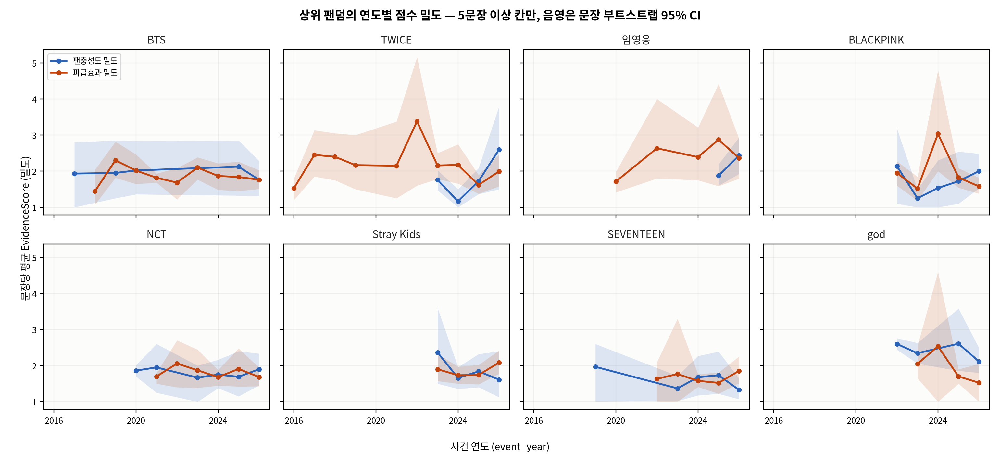
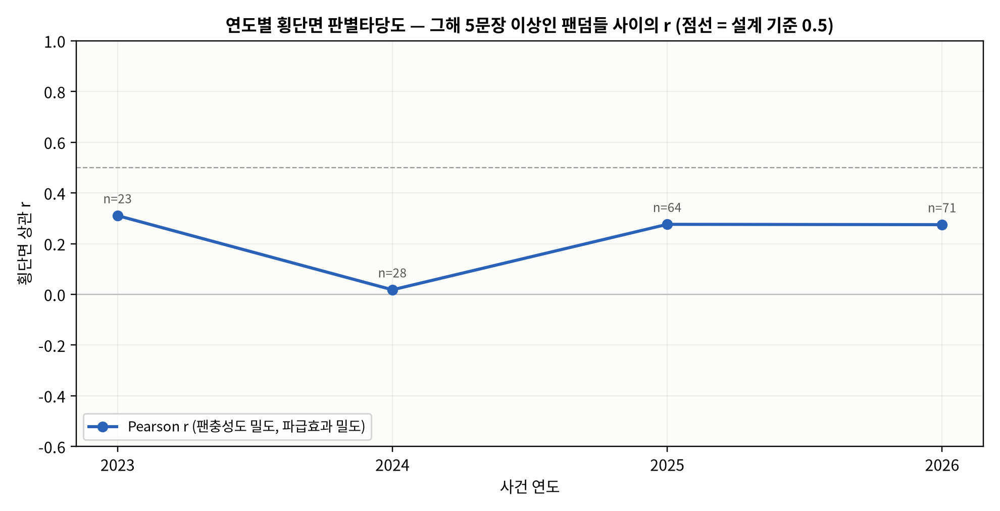
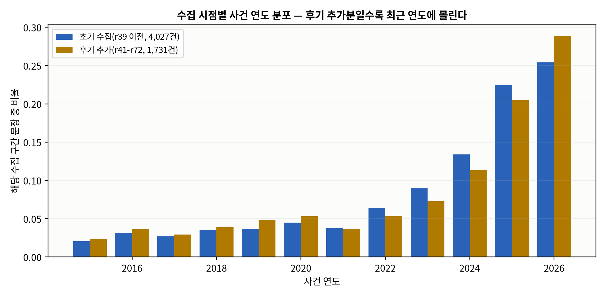
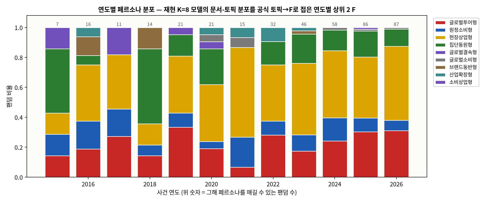

# 시계열 패널 분석 — 근거문장의 시점으로 본 팬충성도·파급효과·경로 비중의 연도별 추이

본 분석(루트 README)과 **별개의 탐색 분석**이다. 해석 계층과 점수 정의는 그대로 두고, 근거문장 10,020건에 사건 연도를 붙여 같은 EvidenceScore 산식을 연도별로 다시 센 팬덤×연도 패널을 만든다. 방법·규칙은 `시계열_패널분석_상세명세서.docx`, 재현은 `timeseries_panel_v7.py`(파이썬)·`시계열_패널분석_v7.ipynb`(노트북)·`R/`(R 대응 코드)이다.

## 0. 결론

1. **시점을 붙일 수 있는 문장은 6,530건(65.2%)** 이다(본문 연도 5,996 · URL 날짜 522 · 상대 표현 12). 본문 연도와 URL 연도가 둘 다 있는 741건 중 같은 해가 664건, ±1년 안이 710건이다.
2. **팬덤×연도 칸 847개 중 5문장 이상인 유효 칸은 414개**, 유효 연도가 3개 이상인 팬덤은 85개(5개 이상 39개)다. 연도별 합에 연도 미상 문장을 더하면 현재 raw 점수가 100/100 재현된다.
3. **코퍼스는 최근에 몰려 있다.** 사건 연도의 48.3%가 2025∼2026년이고, 후기 추가분(r41∼r72)일수록 최근 연도 비중이 높다. 문장 수(규모)는 팬덤 대부분에서 연도와 함께 늘지만(팬덤별 Spearman ρ 중앙값 0.718, 양수 54/59; 유효 연도 4개 이상인 팬덤 기준), 이는 수집 시점의 효과가 섞인 값이라 성장으로 읽지 않는다.
4. **밀도(문장당 평균 EvidenceScore)는 뚜렷한 추세가 없다.** 팬덤별 ρ 중앙값은 충성도 -0.2, 파급효과 -0.059이고, 유의(p<0.05)한 상승/하락은 충성도 0/0개, 파급효과 0/1개다(밀도 추세를 잴 수 있는 팬덤 25개). 이원 고정효과 회귀에서 연도 효과는 충성도 F=1.914 (p=0.0409), 파급효과 F=1.748 (p=0.0633)다.
5. **연도별 횡단면의 충성도–파급효과 관계는 해마다 다르다.** 밀도 기준 r은 0.0181∼0.3107(2023∼2026, 그해 20개 이상 팬덤이 있는 연도만)이며, 팬덤·연도 고정효과를 넣은 패널 내부 계수는 0.067(p=0.44; 통합 0.2754).
6. **경로 비중의 연도 추이(재현 모델 θ 기반)** 에서는 유효 칸이 있는 팬덤 100개 중 첫 유효 연도와 마지막 유효 연도의 페르소나가 다른 팬덤이 63개, 한 번이라도 바뀐 팬덤이 88개다. 다만 이 θ는 저장된 재현 K=8 모델(옛 토크나이저)에서 나온 근사값으로, 전 연도 합산 F 비중과 공식 factor_share의 상관은 F1 0.4 · F2 0.899 · F3 0.801 · F4 0.809 · F5 0.559, 페르소나 일치 40/100에 그친다. 연도 칸이 작아 페르소나가 자주 바뀌는 것은 상당 부분 표본 잡음이며, 이 절은 방향 참고용이지 공식 해석 계층이 아니다.

## 1. 문장 시점 태깅 (A)

| 항목 | 값 |
|---|---|
| 문장 수 | 10,020 |
| 시점 태그 | 6,530 (65.2%) — text 5,996 · url 522 · relative 12 · none 3,490 |
| 2015∼2026 범위 안 | 5,758 (2015년 이전 772) |
| 복수 연도 문장(가장 늦은 연도 채택) | 1,005 |
| 본문 연도 vs URL 연도 | 둘 다 있는 741건 중 같은 해 664, ±1년 710 |

연도별 문장 수: 2015 124 · 2016 192 · 2017 159 · 2018 211 · 2019 231 · 2020 272 · 2021 215 · 2022 351 · 2023 487 · 2024 735 · 2025 1,258 · 2026 1,523

## 2. 팬덤×연도 패널 (B) — 연도별 요약

| 연도 | 문장 | 팬덤(유효) | 평균 충성도 밀도 | 평균 파급효과 밀도 | r(밀도) | ρ(밀도) | r(합) | 후기 추가 비율 |
|---|---|---|---|---|---|---|---|---|
| 2015 | 124 | 3 |  |  |  |  |  | 33% |
| 2016 | 192 | 2 |  |  |  |  |  | 33% |
| 2017 | 159 | 2 |  |  |  |  |  | 32% |
| 2018 | 211 | 7 |  |  |  |  |  | 32% |
| 2019 | 231 | 9 |  |  |  |  |  | 36% |
| 2020 | 272 | 7 |  |  |  |  |  | 34% |
| 2021 | 215 | 4 |  |  |  |  |  | 29% |
| 2022 | 351 | 11 |  |  |  |  |  | 26% |
| 2023 | 487 | 23 | 1.7718 | 1.6652 | 0.3107 | 0.3179 | 0.2515 | 26% |
| 2024 | 735 | 28 | 1.8284 | 1.8219 | 0.0181 | 0.0834 | 0.6245 | 27% |
| 2025 | 1,258 | 64 | 1.8632 | 1.7815 | 0.2763 | 0.2893 | 0.4469 | 28% |
| 2026 | 1,523 | 71 | 1.8277 | 1.7564 | 0.275 | 0.2383 | 0.4697 | 33% |

밀도 = 그해 문장의 평균 EvidenceScore, 합 = 그해 문장 점수 합(규모). r·ρ는 그해 5문장 이상 팬덤 사이의 횡단면 상관이며 20개 미만이면 비운다.

## 3. 팬덤별 추세 (유효 연도 4개 이상)

| 팬덤 | 유효 연도 | 구간 | 규모 ρ | 충성도 밀도 ρ (p) | 파급효과 밀도 ρ (p) |
|---|---|---|---|---|---|
| BTS | 10 | 2017∼2026 | 0.3283 | 0.0 (1.0) | -0.0333 (0.9322) |
| TWICE | 10 | 2016∼2026 | 0.7841 | 0.4 (0.6) | -0.2 (0.5796) |
| 레드벨벳 | 8 | 2017∼2026 | 0.6347 | -0.7 (0.1881) | -0.3964 (0.3786) |
| 오마이걸 | 8 | 2017∼2026 | 0.5183 | -0.8 (0.2) | 0.7827 (0.0657) |
| GOT7 | 7 | 2015∼2025 | 0.3784 | -0.4 (0.6) | -0.4857 (0.3287) |
| NCT | 7 | 2020∼2026 | 0.8469 | -0.1429 (0.7872) | -0.3143 (0.5441) |
| EXO | 6 | 2018∼2026 | 0.0883 | -0.8 (0.2) | -0.2 (0.704) |
| SEVENTEEN | 6 | 2019∼2026 | 0.8117 | -0.6 (0.2848) | 0.1 (0.8729) |
| 김호중 | 6 | 2020∼2026 | -0.3479 | -0.6 (0.2848) | -0.7 (0.1881) |
| 영탁 | 6 | 2020∼2026 | 0.7247 | 0.1 (0.8729) | 0.4286 (0.3965) |
| 10CM | 5 | 2016∼2026 | 0.8721 | -0.2 (0.8) |  () |
| BLACKPINK | 5 | 2022∼2026 | 0.7 | 0.0 (1.0) | -0.2 (0.7471) |
| Crush | 5 | 2016∼2026 | 0.6669 | -0.4 (0.6) | 0.6 (0.4) |
| NewJeans | 5 | 2022∼2026 | 0.2 | -0.4 (0.5046) | -0.8 (0.1041) |
| god | 5 | 2022∼2026 | 0.7182 | -0.4 (0.6) | -0.8 (0.2) |
| 권은비 | 5 | 2022∼2026 | 0.6 | 0.0 (1.0) | -0.6 (0.4) |
| 마마무 | 5 | 2016∼2026 | 0.1539 | -0.3162 (0.6838) | -0.8 (0.1041) |
| 에픽하이 | 5 | 2019∼2026 | 0.7182 | 0.4 (0.6) |  () |
| 이영지 | 5 | 2022∼2026 | 0.9 | 0.0 (1.0) | 0.2 (0.8) |
| BABYMONSTER | 4 | 2023∼2026 | 0.6325 | 0.4 (0.6) | -0.4 (0.6) |

전체는 `output/fandom_trend_v7.csv`(상위 20개만 표시). 유효 연도 3개 미만이라 제외한 팬덤: CORTIS, 아이오아이, 잭스키스, Hearts2Hearts, A-pink, 브라운아이즈, sg워너비, 보아, 이승철, FTISLAND, 케이윌, 김연자, 이문세, 백지영, 박정현.

## 4. 고정효과 회귀와 수집 편향 (E)

| 종속변수 | 칸 | R²(팬덤 FE) | R²(팬덤+연도 FE) | 연도 효과 F (p) | 후기 추가 비율 계수 (p) |
|---|---|---|---|---|---|
| 충성도 밀도 | 272 | 0.537 | 0.5899 | 1.914 (0.0409) | 0.1556 (0.386) |
| 파급효과 밀도 | 373 | 0.4202 | 0.4598 | 1.748 (0.0633) | -0.029 (0.801) |

충성도–파급효과 패널 회귀(S ~ L): 통합 계수 0.2754 (p=1.38e-06), 팬덤·연도 고정효과 후 0.067 (p=0.44), 칸 231. 로그 문장 수의 연도 효과(2015 대비): 2016 -0.23, 2017 -0.26, 2018 +0.09, 2019 -0.07, 2020 +0.08, 2021 -0.15, 2022 -0.20, 2023 -0.01, 2024 +0.15, 2025 +0.45, 2026 +0.61.

## 5. 경로 비중의 연도 추이와 페르소나 전이 (C, 근사)

재현 K=8 모델(`topic_phi_cosine/lda_model_k8_v7_final.pkl`, 옛 토크나이저·9,954문서)의 θ를 토픽 대응표(D_live_reference_k8→E_live_k8, Hungarian)로 공식 토픽에 잇고 공식 토픽→F 배정으로 접었다. 대응 Jaccard가 낮은 토픽이 있어 근사다.

| 재현 토픽 | 공식 토픽 | F | Jaccard(top10) |
|---|---|---|---|
| E0 | T7 | F1 | 0.1111 |
| E1 | T3 | F2 | 0.6667 |
| E2 | T5 | F3 | 0.25 |
| E3 | T2 | F3 | 0.25 |
| E4 | T6 | F3 | 0.1765 |
| E5 | T4 | F3 | 0.1765 |
| E6 | T1 | F5 | 0.5385 |
| E7 | T0 | F4 | 0.5385 |

검증: 전 연도 합산 θ-F 비중 vs 공식 factor_share 상관 F1 0.4 · F2 0.899 · F3 0.801 · F4 0.809 · F5 0.559, 평균 절대 차이 0.0423, 페르소나 일치 40/100.

| 팬덤 | 유효 연도 | 첫 연도 페르소나 | 마지막 연도 페르소나 | 전환 횟수 | 경로 |
|---|---|---|---|---|---|
| 레드벨벳 | 8 | 2017 현장상업형 | 2026 글로벌투어형 | 4 | 2017:현장상업형 → 2018:현장상업형 → 2021:현장상업형 → 2022:글로벌투어형 → 2023:원정소비형 → 2024:원정소비형 → 2025:현장상업형 → 2026:글로벌투어형 |
| GOT7 | 7 | 2015 글로벌결속형 | 2025 현장상업형 | 6 | 2015:글로벌결속형 → 2018:집단동원형 → 2019:글로벌투어형 → 2020:산업확장형 → 2021:현장상업형 → 2022:글로벌투어형 → 2025:현장상업형 |
| NCT | 7 | 2020 글로벌결속형 | 2026 현장상업형 | 4 | 2020:글로벌결속형 → 2021:산업확장형 → 2022:현장상업형 → 2023:현장상업형 → 2024:글로벌투어형 → 2025:글로벌투어형 → 2026:현장상업형 |
| Zion.T | 7 | 2015 글로벌투어형 | 2025 원정소비형 | 6 | 2015:글로벌투어형 → 2016:브랜드동반형 → 2017:원정소비형 → 2019:현장상업형 → 2021:원정소비형 → 2024:집단동원형 → 2025:원정소비형 |
| BTOB | 6 | 2015 집단동원형 | 2026 원정소비형 | 4 | 2015:집단동원형 → 2016:글로벌투어형 → 2020:원정소비형 → 2022:글로벌투어형 → 2025:원정소비형 → 2026:원정소비형 |
| EXO | 6 | 2018 브랜드동반형 | 2026 현장상업형 | 3 | 2018:브랜드동반형 → 2020:집단동원형 → 2023:원정소비형 → 2024:현장상업형 → 2025:현장상업형 → 2026:현장상업형 |
| SEVENTEEN | 6 | 2019 현장상업형 | 2026 글로벌투어형 | 4 | 2019:현장상업형 → 2022:집단동원형 → 2023:집단동원형 → 2024:현장상업형 → 2025:원정소비형 → 2026:글로벌투어형 |
| 김호중 | 6 | 2020 글로벌투어형 | 2026 현장상업형 | 5 | 2020:글로벌투어형 → 2022:현장상업형 → 2023:원정소비형 → 2024:현장상업형 → 2025:집단동원형 → 2026:현장상업형 |
| 영탁 | 6 | 2020 현장상업형 | 2026 글로벌투어형 | 3 | 2020:현장상업형 → 2022:원정소비형 → 2023:현장상업형 → 2024:현장상업형 → 2025:현장상업형 → 2026:글로벌투어형 |
| 청하 | 6 | 2019 현장상업형 | 2026 글로벌투어형 | 1 | 2019:현장상업형 → 2020:현장상업형 → 2023:현장상업형 → 2024:현장상업형 → 2025:글로벌투어형 → 2026:글로벌투어형 |
| 츄 | 6 | 2021 현장상업형 | 2026 글로벌투어형 | 1 | 2021:현장상업형 → 2022:현장상업형 → 2023:현장상업형 → 2024:현장상업형 → 2025:현장상업형 → 2026:글로벌투어형 |
| 10CM | 5 | 2016 산업확장형 | 2026 글로벌투어형 | 4 | 2016:산업확장형 → 2020:집단동원형 → 2024:글로벌투어형 → 2025:현장상업형 → 2026:글로벌투어형 |
| BLACKPINK | 5 | 2022 산업확장형 | 2026 글로벌투어형 | 1 | 2022:산업확장형 → 2023:글로벌투어형 → 2024:글로벌투어형 → 2025:글로벌투어형 → 2026:글로벌투어형 |
| Crush | 5 | 2016 원정소비형 | 2026 현장상업형 | 3 | 2016:원정소비형 → 2023:원정소비형 → 2024:글로벌투어형 → 2025:집단동원형 → 2026:현장상업형 |
| ITZY | 5 | 2022 산업확장형 | 2026 글로벌투어형 | 4 | 2022:산업확장형 → 2023:현장상업형 → 2024:글로벌투어형 → 2025:현장상업형 → 2026:글로벌투어형 |

전체는 `output/persona_transition_v7.csv`.

## 6. 한계

1. 사건 연도는 언론이 언급한 연도의 근사다. 회고 서술이 과거 연도를 만들고, 최근 사건은 연도를 생략하기도 한다. 복수 연도 문장은 가장 늦은 연도를 쓴다.
2. 코퍼스는 최근 편중이며 팬덤마다 편중이 다르다. 신생 그룹의 과거 칸은 비어 있고, 규모 추세는 수집 시점과 섞여 있다. 밀도·점유율·고정효과로 보정했지만 완전하지 않다.
3. 연도 칸의 표본은 작다(중앙값 수 문장). 한 해 값보다 방향과 CI를 읽는다.
4. 5절의 θ는 공식 모델이 아니라 저장된 재현 모델에서 나온 것이며, 토픽 대응이 약한 곳이 있다. 페르소나 전이는 방향 참고용이다.
5. 해석 계층·순위표·README 수치는 이 분석으로 바뀌지 않는다.

## 7. 파일

| 파일 | 내용 |
|---|---|
| `output/sentence_time_tags_v7.csv` | 문장 10,020건의 시점 태그(본문 연도·URL 날짜·상대 표현·event_year·year_source) |
| `output/fandom_year_panel_v7.csv` | 팬덤×연도 칸: 문장 수·점수 합·밀도·연도 점유율·후기 추가 비율·유효 여부 |
| `output/year_summary_v7.csv` · `fandom_trend_v7.csv` · `bootstrap_year_cells_v7.csv` · `round_year_distribution_v7.csv` | 연도 요약, 팬덤별 추세, 상위 8개 팬덤 연도 칸 CI, 수집 구간별 연도 분포 |
| `output/fandom_year_factor_share_v7.csv` · `persona_transition_v7.csv` | 연도별 F 비중과 페르소나, 첫·마지막 연도 전이 |
| `output/summary_v7.json` | 위 표들의 요약 수치(명세서·노트북·R 대조용) |
| `output/fig_ts01∼04*.png` | 그림 4장 |
| `timeseries_panel_v7.py` · `build_timeseries_notebook_v7.py` · `시계열_패널분석_v7.ipynb` · `R/` | 재현 코드 |
